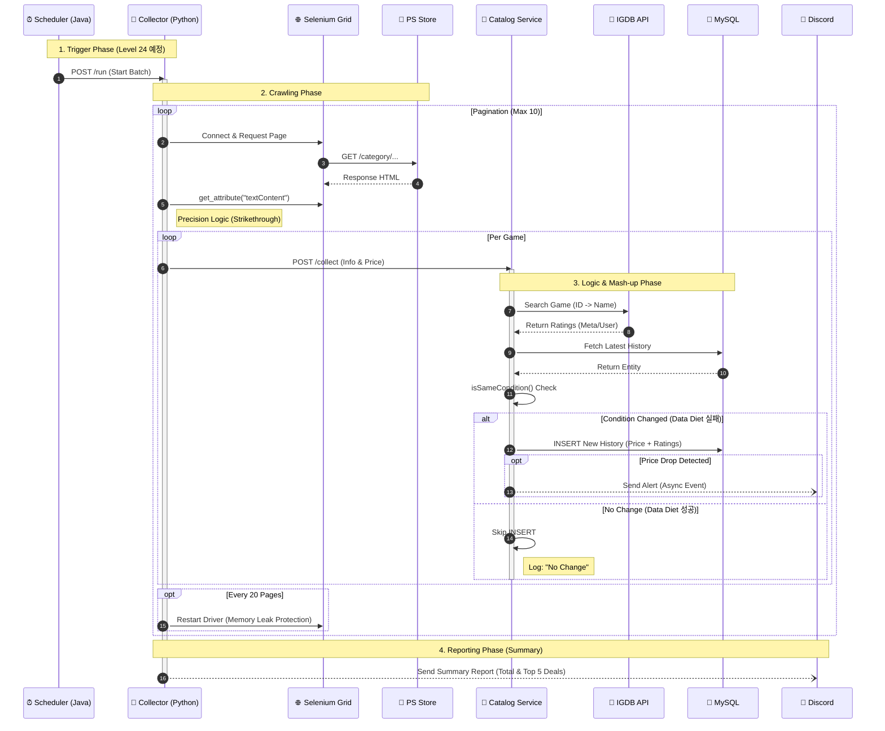
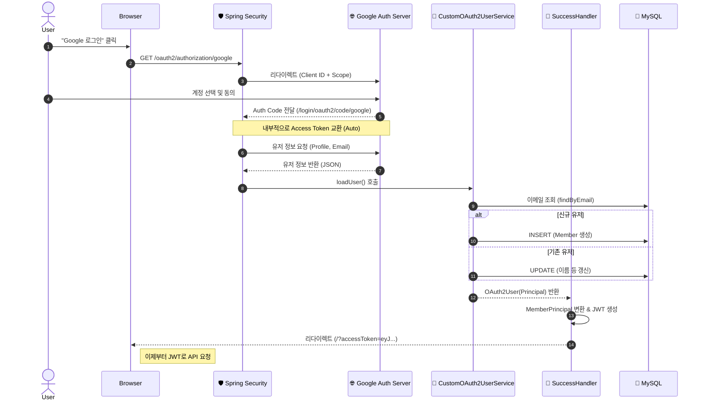

# 🎮 Project: PS-Tracker (PlayStation Store Intelligence Platform)

> **"잠들지 않는 감시자."**
> 플레이스테이션 게이머를 위한 **완전 자동화된 최저가 추적 및 AI 기반 추천** 플랫폼

[](https://ps-signal.com)
[](LICENSE)

## 1. 프로젝트 개요 (Overview)
* **Start Date:** 2025.11.23
* **Status:** Level 34 Complete (In-App Notification System Implemented)
* **Goal:** "가격(Price)" 정보를 넘어 "가치(Value/Rating)" 정보를 통합하여 합리적 구매 판단을 지원하는 플랫폼

### 🎯 핵심 가치 (Value Proposition)
1.  **Automation:** 인간의 개입 없이 매일 새벽, 스스로 최신 정보를 수집하고 갱신.
2.  **Stability:** MSA 구조와 도커 컨테이너를 통해 환경에 구애받지 않는 안정적인 실행 보장.
3.  **Intelligence:** 단순 수집을 넘어, '갱신이 필요한 게임'만 선별하고 **'변동이 있을 때만 저장'** 하여 효율 극대화.
4.  **Resilience:** 네트워크 지연, 레이아웃 변경, 보이지 않는 텍스트 등 온갖 예외 상황에서도 살아남는 강인한 수집 능력.
5.  **Reactivity:** 가격 하락 감지 시, 0.1초 내에 사용자에게 Discord 알림 발송.
6.  **Value-Aware:** 단순 최저가가 아닌, Metacritic 점수와 유저 평점을 함께 제공하여 '싼 게 비지떡'인지 '숨겨진 명작'인지 판별.
7.   **Insight:** 복합 조건(할인율+평점+가격) 검색을 통해 사용자가 원하는 "진짜 꿀매물"을 발굴.
8. **Gamification:** '가성비 전투력', '가격 신호등', '플래티넘 딜' 등의 요소를 도입하여 재미와 직관성 극대화.
9. **User Experience:** 장르 파도타기(Wave Animation), 글래스모피즘(Glassmorphism) UI, 다크 모드 등 최신 트렌드를 반영한 몰입형 인터페이스.

---

## 2. 아키텍처 (Fully Dockerized MSA)

### 🏗 구조 및 역할 (The 5-Container Fleet + Frontend)
| Service Name | Tech Stack | Role | Port |
| :--- | :--- | :--- | :--- |
| **Frontend** | React, Nginx | **[Face]** UI/UX, Reverse Proxy (SSL Termination) | 80, 443 (Docker) |
| **Catalog Service** | Java 17, Spring Boot | **[Brain]** 스케줄러, **회원/인증 관리**, DB 적재 | 8080 |
| **Collector Service** | Python 3.10, Flask | **[Hand]** HTTP 명령 수신, Selenium Grid 원격 제어 | 5000 |
| **Selenium Grid** | Standalone Chrome | **[Eyes]** 도커 내부에서 브라우저 실행 (Remote Driver) | 4444 / 7900 |
| **MySQL** | MySQL 8.0 | **[Storage]** 정규화된 데이터 저장 (Volume Mount) | 3307 |
| **Adminer** | Adminer | **[Admin]** DB 관리 웹 인터페이스 | 8090 |

### 🔄 자동화 데이터 흐름 (Automation Flow)
1.  **Trigger:** Java 스케줄러가 매일 새벽 4시 (혹은 API 호출 시) Python Flask 서버(`POST /run`)를 깨움.
2.  **Smart Crawl:** Python이 Selenium으로 최신 가격을 수집 (Retry & JS Injection 적용)하여 Java로 전송.
3.  **Logical Compare: Java(`CatalogService`)가 DB의 '직전 가격' 및 '할인 조건'을 정밀 비교.
4.  **Save on Change: 변동이 감지된 경우에만 INSERT 수행 (Data Diet).
5.  **Notify:** 가격 하락 시 `GamePriceChangedEvent` 발행 → Discord Webhook 비동기 전송.

---

## 3. 핵심 구현 내용 (Technical Details)

### ① Catalog Service (Java) - The Brain
* **Smart Upsert Pattern:** 무조건적인 `INSERT`를 지양하고, 엔티티(`GamePriceHistory`) 내부에 `isSameCondition()` 비즈니스 로직을 구현. 가격, 할인율, 세일 종료일, Plus 혜택 여부 등을 비교하여 "실질적 변동"이 있을 때만 저장함으로써 DB 공간 절약 및 멱등성 확보.
* **Targeting Logic:** '기간 존중' 원칙에 따라 갱신이 필요한 게임만 선별하여 수집기에게 전달.
* **Event System:** `ApplicationEventPublisher`를 사용하여 비즈니스 로직과 알림 로직을 분리

### ② Collector Service (Python) - The Hand
* **Universal Parser:** 게임마다 다른 레이아웃("포함", "무료", 다중 오퍼 등)을 모두 처리할 수 있는 범용 파싱 로직 구현.
* **Container-Based Scanning:** 특정 아이콘만 찾는 '저격수' 방식에서, 가격 박스 전체(`offer_container`)를 확보한 뒤 텍스트와 태그를 복합적으로 분석하는 '산탄총' 방식으로 전환하여 Plus 회원 전용가 인식률 100% 달성.
* **Deep DOM Extraction:** 화면에 렌더링되지 않은 텍스트(Hidden Elements)를 읽지 못하는 `.text` 속성의 한계를 극복하기 위해, `get_attribute("textContent")`를 사용하여 DOM 내부의 원시 데이터를 직접 추출.
* **Smart Wait & Retry:** 네트워크 지연에 대비한 `Explicit Wait`와 간헐적 실패(Flaky)를 잡기 위한 `Retry Mechanism` 도입.
* **Self-Healing Pagination:** 대량 수집(Max 300 Page) 시 발생할 수 있는 브라우저 메모리 누수(Memory Leak)를 방지하기 위해, 일정 주기(20페이지)마다 드라이버를 스스로 리셋(Restart)하여 장기 실행 안정성 확보.

### ③ Notification System (The Watcher)
무분별한 알림(Spam)을 방지하고 시스템 효율성을 높이기 위해 **이원화된 알림 전략** 채택.
* **External (Discord):** Python Collector가 담당. 크롤링 종료 후 **"일일 수집 요약 리포트(Summary Report)"**를 1회 발송하여 관리자 피로도 최소화.
* **Internal (Event):** Java Backend가 담당. 가격 변동 감지 시 `GamePriceChangedEvent`를 발행하여, 추후 **'인앱 알림 센터(Notification History)'** 적재를 위한 데이터 파이프라인 유지 (Decoupling).

### ④ Value Integration (IGDB API) - The Intelligence
* **Heuristic Search Algorithm:** 기계적인 ID 매칭의 한계(Region Lock)를 극복하기 위해, **'데이터의 특성'**을 활용한 휴리스틱 알고리즘 도입.
    1. **Noise Reduction:** "Digital Deluxe", "Sound Edition", "PS5" 등 검색 정확도를 떨어뜨리는 노이즈 키워드를 Regex로 정밀 타격하여 제거.
    2. **English Title Priority:** PS Store에서 수집한 한글 제목 대신, 데이터 매칭 확률이 높은 **영문 제목(English Title)**을 우선 사용하여 검색.
    3. **Popularity Sorting:** 검색 결과 중 **`total_rating_count`(전체 리뷰 수)가 가장 많은 항목**을 본편(Main Game)으로 간주하여 선택 (정확도 95% 이상).
* **Fail-Safe Design:** 외부 API(IGDB) 장애나 평점 누락이 내부 핵심 로직(가격 저장)을 방해하지 않도록 철저한 격리 (`try-catch` & `Log-only`).

### ⑤ Anti-Ban Strategy (The Stealth)
- Stealth Mode: `undetected-chromedriver`를 도입하여 '봇 탐지'를 우회하고 사람처럼 행동.
- Respect Period (기간 존중): Java Repository 레벨에서 **"할인 기간이 남은 게임"**은 수집 대상에서 원천 배제(NOT EXISTS 쿼리). 트래픽을 90% 이상 절감하여 차단 확률 최소화.
- Smart Target: 무조건적인 전수 조사(300페이지)를 버리고, "베스트 셀러(10페이지) + 유저 찜(On-Demand)" 전략으로 전환.

### ⑥ Text Normalization Engine (The Filter)
IGDB 검색 성공률을 끌어올린 정규화 로직.
* **Platform Tag Removal:** `PS4`, `PS5`, `PS VR2` 등 불필요한 플랫폼 태그 삭제.
* **Edition Cleaner:** `Deluxe`, `Ultimate`, `Game of the Year` 등 에디션 명칭을 제거하여 본편 검색 유도.
* **Hidden Noise Filter:** `Sound`, `Anime`, `Music` 등 애니메이션 게임의 부제가 본편 제목을 가리는 현상을 방지하기 위해 조건부 제거 로직 적용.
* **Invisible Char Trimmer:** 탭(`\t`), 줄바꿈, 인코딩 찌꺼기 등 눈에 보이지 않는 문자열 전처리.

### ⑦ Search Engine (QueryDSL) - The Analyst
Spring Boot 3 + QueryDSL 5.0 기반의 Type-Safe 동적 쿼리 엔진 구축.
* **Complex Filtering:** 가격 범위(`min/max`), 할인율, 메타/유저 평점, 플랫폼 등 N개의 조건을 조합하여 검색 가능.
* **Snapshot Query:** `Game`과 `GamePriceHistory`의 1:N 관계에서, `JPAExpressions` 서브쿼리를 사용하여 "가장 최근 가격(Last Recorded)" 만을 정확하게 조인(Latest Snapshot).
* **Zero-Overhead Projection:** 엔티티 전체를 조회하는 비효율을 제거하기 위해, `@QueryProjection`을 사용하여 필요한 데이터만 DTO로 즉시 변환. (조회 성능 최적화)

### ⑧ Member & Security (The Gatekeeper)
Spring Security 6.1+ (Lambda DSL)와 JWT를 활용한 Stateless 인증 시스템 구축.
* **Stateless Architecture:** 세션을 사용하지 않고, **JWT(Access + Refresh Token)** 기반의 토큰 인증을 구현하여 MSA 환경에서의 확장성 확보.
* **Standard Auth Flow:** `UserDetailsService`를 정석으로 구현하여 Spring Security의 표준 인증 체계(Provider -> Manager -> Filter)를 준수.
* **Secure Password:** `BCryptPasswordEncoder`를 사용하여 비밀번호를 안전하게 단방향 암호화하여 저장.
* **Fine-Grained Access Control:**
    * `Public`: 게임 조회, 검색, 회원가입, 로그인
    * `User`: 내 정보 조회, (추후) 찜하기
    * `Admin`: 수동 크롤링 트리거(`manual-crawl`) 등 관리자 기능

### ⑨ Wishlist & Optimization (The Memory)
단순한 N:M 매핑을 넘어, 대규모 트래픽 상황을 가정한 **Extreme Performance Tuning** 적용.
* **Zero-Select Write:** 찜하기 요청 시, `SecurityContext`의 JWT에서 파싱한 ID와 `getReferenceById(Proxy)`를 결합하여 **DB 조회 없이(0 Select)** 즉시 `INSERT` 수행.
* **MemberPrincipal Expansion:** JWT 토큰 페이로드에 `memberId(PK)`를 포함시켜, 인증 필터 단계에서 DB 접근 없이 완전한 인증 객체 생성.
* **Fetch Join & Batch Size:** "내 찜 목록" 조회 시 QueryDSL `Fetch Join`으로 게임 정보를 한 번에 가져오고, `default_batch_fetch_size` 설정을 통해 N+1 문제 없이 가격 정보까지 효율적으로 로딩.

### ⑩ OAuth2 Social Login (The Key)
복잡한 가입 절차를 제거하고, `Spring Security OAuth2 Client`를 활용하여 원클릭 로그인 시스템 구축.
* **Seamless Onboarding:** 구글 로그인 시 `CustomOAuth2UserService`가 자동으로 회원을 식별하여, 신규 유저는 '가입(Insert)', 기존 유저는 '정보 갱신(Update)'을 수행하는 `SaveOrUpdate` 로직 구현.
* **JWT Bridge:** 소셜 로그인 성공 직후 `AuthenticationSuccessHandler`가 개입하여, OAuth2 인증 정보를 우리 시스템 전용 **JWT(Access/Refresh Token)로 즉시 교환**하여 발급.
* **Secret Isolation:** `application.yml`(공개)과 `application-secret.yml`(비공개)을 분리하고 `.gitignore` 처리하여, DB 비밀번호 및 OAuth Client Secret 등의 민감 정보가 깃허브에 노출되는 것을 원천 차단.

### ⑪ Frontend System (The Interface) - React & Tailwind [Updated Lv.30]
API 테스트 도구를 넘어, **상용 서비스 수준의 High-End UX/UI**를 갖춘 시각화 플랫폼 구축.
* **Tech Stack:** React 18, Vite, Tailwind CSS (Dark Mode), Axios, React-Hot-Toast, Date-fns, Lucide-React (Icons).
* **Gamification & Visual Features:**
    * **Combat Power (전투력 측정기):** 메타스코어와 가격을 복합 연산하여 "가성비 지수"를 수치화하고, 불꽃 애니메이션으로 시각화.
    * **Traffic Light (가격 신호등):** 복잡한 가격 변동 내역을 분석하여 `초록불(구매 적기)`, `노란불(평균)`, `빨간불(비쌈)`로 직관적 가이드 제공.
    * **Platinum Deal (플래티넘 딜):** '메타스코어 85점 이상 & 할인율 50% 이상'인 명작 게임에 황금빛 아우라(Glow Effect)와 반짝임(Sparkle) 효과 자동 적용.
    * **Genre Surfing (장르 파도타기):** 정적인 필터 대신, CSS Keyframes를 활용한 웨이브 이퀄라이저 애니메이션을 적용하여 탐색의 재미 요소 추가.
* **Design System (Glassmorphism):**
    * 넷플릭스 스타일의 **Hero Backdrop**과 블러 처리된 반투명 카드 UI(Glass Effect)를 적용하여 고급스러운 톤앤매너 완성.
    * 로그인 페이지부터 상세 페이지까지 일관된 **Dark Themed UI** 제공.
* **User-Centric Features:**
    * **Smart Feedback:** 브라우저 기본 Alert를 제거하고, `React-Hot-Toast`를 커스텀하여 부드럽고 세련된 알림 제공.
    * **Onboarding:** '가이드 모달'과 '이용약관 모달'을 구현하여 사용자의 이해를 돕고 법적 요건 충족.

### ⑫ Infrastructure (The Ship) - Docker & Nginx
개발 환경과 배포 환경의 일치성을 보장하는 **완전 컨테이너화 아키텍처** 구현.
* **Multi-stage Build:** React 앱을 Node.js 환경에서 빌드하고, 결과물만 Nginx 이미지로 복사하여 이미지 크기를 90% 이상 경량화 (Alpine Linux 기반).
* **Reverse Proxy:** Nginx를 프론트엔드 웹 서버이자 API Gateway로 활용.
* **Resource Engineering (The Survival):** [NEW]
  * **Memory Swap:** 1GB RAM 환경(Oracle Cloud Micro)의 한계를 극복하기 위해 **4GB 스왑 메모리(Swap)**를 할당, OOM Killer 방지.
  * **JVM Tuning:** Java 컨테이너에 `-Xms128M -Xmx256M` 옵션을 적용하여 힙 메모리 사용량을 엄격하게 제한.
  * **Container Limits:** Docker Compose `deploy.resources` 설정을 통해 Selenium 등 리소스 집약적 컨테이너가 서버 전체를 마비시키지 않도록 CPU 사용량 제한(Throttling).

### ⑬ Environment Strategy (Profile Isolation)
로컬 개발 생산성과 운영 환경 안정성을 동시에 잡기 위한 Spring Profile 전략 수립.
* **Local (`active: local`):** 개발자 PC(`localhost:3307`)에서 실행되며, 로컬 Docker DB에 접속. 코드 수정 없이 즉시 테스트 가능.
* **Prod (`active: prod`):** Docker Compose 환경(`mysql:3306`)에서 실행되며, 컨테이너 내부 네트워크(DNS)를 통해 통신.
* **Config Management:** `application-local.yml`과 `application-prod.yml`을 분리하여 빌드/배포 시 설정 충돌 원천 차단.

### ⑭ Security & SSL (The Shield) - Let's Encrypt & Certbot
사용자 정보 보호와 구글 OAuth 보안 정책 준수를 위한 완벽한 HTTPS 환경 구축.
* **SSL Termination:** Nginx가 443 포트에서 암호화된 트래픽(HTTPS)을 받아 복호화한 뒤, 내부망(80)을 통해 React와 백엔드로 전달하는 구조.
* **Certbot Integration:**
  * **Webroot 방식:** Nginx를 끄지 않고도 `.well-known` 챌린지를 통해 인증서를 발급받도록 도커 볼륨(`volumes`) 공유.
  * **Auto Renewal:** `Crontab`을 활용하여 매월 1일, 15일 새벽에 인증서 만료를 체크하고 자동으로 갱신(Renew) 및 Nginx 리로드(Reload) 수행.
* **Security Headers:** `Strict-Transport-Security` 및 `redirect 301` 설정을 통해 HTTP 접근을 강제로 HTTPS로 전환.

### ⑮ In-App Notification System (The Bell)
사용자의 재방문을 유도하고 구매 전환율을 높이는 **실시간 인앱 알림 시스템**.
* **Event-Driven Architecture:** `CatalogService`가 가격 하락을 감지하면 `GamePriceChangedEvent`를 발행하고, 리스너가 이를 비동기(`@Async`)로 처리하여 `Notification` 테이블에 적재.
* **Reactive UX:** React Navbar에서 안 읽은 알림(Red Badge)을 실시간으로 표시하고, 클릭 시 '읽음 처리'와 동시에 해당 게임 페이지로 이동하는 UX 제공.


---

## 4. 아키텍처 의사결정 (ADR: Event vs MQ)

### Q. 왜 RabbitMQ나 Kafka 같은 메시지 큐를 쓰지 않고 Spring Event를 사용했는가?
우리는 **오버 엔지니어링을 경계**하고 현재 규모에 가장 적합한 **실용주의적 아키텍처**를 선택했습니다.

| 비교 항목 | Spring Event (In-Memory) | Message Queue (Kafka/RabbitMQ) |
| :--- | :--- | :--- |
| **채택 여부** | **✅ 채택 (Current)** | ❌ 보류 (Future) |
| **비유** | 옆자리 동료에게 쪽지 건네기 | 우체국에 등기 우편 보내기 |
| **범위** | 단일 JVM (같은 프로세스 내부) | 분산 시스템 (서버 간 통신) |
| **복잡도** | 최하 (코드 몇 줄로 구현) | 중/상 (별도 인프라 구축 필요) |

> **💡 결정 이유**
> 1. 현재 단일 인스턴스이며, 알림 누락이 서비스에 치명적이지 않음.
> 2. 초기 단계에서는 **구현 속도와 유지보수성**을 최우선으로 함.
> 3. *추후 인스턴스가 확장되거나, 결제 알림 등 영속성이 필수적인 기능이 추가될 때 도입 예정.*

### Q. 왜 Session 대신 JWT를 선택했는가?
단일 서버임에도 불구하고 Session 방식 대신 JWT를 도입했습니다.

| 비교 항목 | Session 기반 | JWT (Token) 기반 |
| :--- | :--- | :--- |
| **채택 여부** | ❌ | **✅ 채택** |
| **저장소** | 서버 메모리 (Stateful) | 클라이언트 (Stateless) |
| **확장성** | 서버 다중화 시 세션 클러스터링 필요 | **서버가 늘어나도 별도 설정 불필요** |
| **Client** | 웹 브라우저 친화적 | **Web/Mobile/App 어디서든 사용 용이** |

> **💡 결정 이유**
> 1.  **Collector Service와의 확장성:** 추후 수집기가 별도 인증을 태워야 하거나, 모바일 앱 출시를 고려할 때 토큰 방식이 유리함.
> 2.  **REST API 원칙 준수:** 서버는 클라이언트의 상태를 저장하지 않아야 한다(Stateless)는 REST 아키텍처 스타일에 부합.

<br>

## 5. 수집 정책: 4원칙 (The Crawling Constitution)

시스템의 안정성과 지속 가능성을 위해 아래 3가지 원칙을 준수합니다.

**✅ 1. 기간 존중 (Respect Period)**
* Java 애플리케이션이 선별해 준 **'갱신 대상'**만 우선 처리하며, 불필요한 트래픽을 유발하지 않는다.

**✅ 2. 데이터 다이어트 (Data Diet)**
* "변하지 않았다면 기록하지 않는다."
* 불필요한 중복 데이터를 방지하여 스토리지 비용을 절감하고 조회 성능을 유지한다.

**✅ 3. 정밀 타격 (Precision Strike)**
* "보이지 않는 것도 본다."
* 단순 텍스트 추출이 아닌, DOM 내부의 `textContent`를 조회하여 렌더링 이슈를 극복한다.
* 실패 시 즉시 포기하지 않고, 재시도(Retry)를 통해 수집 성공률을 올린다.

**✅ 4. 안전 제일 (Safety First)**
* `StaleElementReferenceException` 방지를 위한 **[탐색]**과 [방문] 로직 분리.
* 수집 건수 제한(Limit) 및 딜레이(Sleep) 적용.
<br>

## 6. 핵심 코드 스니펫 (Code Context)

### 📢 Event Publisher (`CatalogService.java`)
가격 변동이 감지되면 이벤트를 발행합니다. 구독자(Listener)가 누구인지는 알 필요가 없는 **느슨한 결합**을 유지합니다.

```java
// 핵심 로직: 가격 하락 시에만 이벤트 발행
if (oldPrice != null && request.getCurrentPrice() < oldPrice) {
        log.info("🚨 Price Drop Detected! {} ({} -> {})", game.getName(), oldPrice, request.getCurrentPrice());

        // 이벤트를 던지고 즉시 다음 로직으로 넘어감 (Non-blocking)
        eventPublisher.publishEvent(new GamePriceChangedEvent(
        game.getName(),
        game.getPsStoreId(),
        oldPrice,
        request.getCurrentPrice(),
        request.getDiscountRate(),
        game.getImageUrl()
    ));
            }
```

### 👂 Async Listener (`DiscordNotificationListener.java`)
이벤트를 수신하여 비동기로 처리합니다. 메인 로직의 성능에 영향을 주지 않습니다.

```java
@Async // 별도 스레드에서 실행 (메인 로직 블로킹 방지)
@EventListener
public void handlePriceChange(GamePriceChangedEvent event) {
    // Discord Webhook으로 실제 알림 전송
    String message = String.format("🚨 가격 하락! %s: %d원 -> %d원", 
                                   event.getGameName(), event.getOldPrice(), event.getNewPrice());
    restTemplate.postForEntity(webhookUrl, payload, String.class);
}
```

### 🛡️ Smart Upsert (`CatalogService.java`)

```java
// 변동이 있을 때만 저장 (Data Diet)
if (shouldSaveHistory(latestHistoryOpt, request)) {
        priceHistoryRepository.save(history); // INSERT
checkAndPublishAlert(...); // 알림 체크
} else {
        log.debug("👌 No Change: {} (Skipping DB Insert)", game.getName());
}
```

### 🕷️ Invisible Text Extraction (`app.py`)
Selenium의 한계를 넘어서는 JavaScript 주입 기법.

```python
# 요소를 화면 중앙으로 강제 스크롤 (로딩 유도)
driver.execute_script("arguments[0].scrollIntoView({block: 'center'});", price_elem)

# DOM Attribute Access (변경)
# 화면 표시 여부(visibility)와 무관하게 DOM 트리에 있는 텍스트 원본을 가져옴
raw_price = price_elem.get_attribute("textContent").strip()
```

---

### 🕷🔍 Dynamic Query (`GameRepositoryImpl.java`)
QueryDSL을 활용하여 복합 조건 검색과 최신 가격 스냅샷 조회를 동시에 처리

```java
// 핵심 로직: 1:N 관계에서 가장 최근의 가격 이력만 가져오기 (Subquery)
gamePriceHistory.recordedAt.eq(
        JPAExpressions
                .select(gamePriceHistory.recordedAt.max())
        .from(gamePriceHistory)
        .where(gamePriceHistory.game.eq(game))
        ),
// 동적 검색 조건 (Null Safe)
nameContains(condition.getKeyword()),
priceBetween(condition.getMinPrice(), condition.getMaxPrice()),
metaScoreGoe(condition.getMinMetaScore())
```

---

## 7. OAuth2 구현 가이드 (Implementation Guide)

### 🌊 인증 흐름도 (Authentication Flow)
사용자가 "구글 로그인" 버튼을 누른 순간부터 JWT를 발급받기까지의 과정을 시각화.



### 🛠️ 구현 체크리스트 (Step-by-Step)
스프링 부트에 소셜 로그인을 이식하기 위한 4단계 표준 절차.

| 단계 | 파일/위치 | 핵심 역할 |
| :--- | :--- | :--- |
| **Step 1. 환경 설정** | `Google Cloud Console` | 프로젝트 생성 → `OAuth 동의 화면` 설정 → `Client ID/Secret` 발급.<br>(Redirect URI: `{BaseURL}/login/oauth2/code/google`) |
| **Step 2. 의존성 & 설정** | `build.gradle`<br>`application-secret.yml` | `oauth2-client` 라이브러리 추가.<br>발급받은 키(ID, Secret)를 보안 파일에 등록. |
| **Step 3. 비즈니스 로직** | `CustomOAuth2UserService` | 구글에서 받은 JSON 데이터를 `OAuthAttributes` DTO로 변환.<br>DB에 **저장(Join)하거나 갱신(Update)**하는 로직 수행. |
| **Step 4. 토큰 발급** | `SuccessHandler`<br>`SecurityConfig` | 로그인 성공 시 **JWT를 생성**하여 클라이언트로 전달(Redirect).<br>Security 설정에 `.oauth2Login()` 및 핸들러 등록. |

---

## 8. 트러블슈팅 (Troubleshooting Log)
개발 과정에서 마주친 주요 이슈와 해결 방법

### 💥 Issue 1: Docker 내부 통신 불가
* **원인:** 컨테이너 내부에서 `localhost`는 호스트 머신이 아닌 컨테이너 자기 자신을 의미함.
* **해결:** Docker Compose Service Name(`catalog-service`)을 호스트명으로 사용하여 DNS 기반 통신 구현.

### 💥 Issue 2: GUI 없는 리눅스에서의 Selenium 실행
* **해결:** **Selenium Grid (Standalone Chrome)** 컨테이너를 별도로 띄우고, Python에서 `Remote WebDriver`로 원격 접속하여 해결.

### 💥 Issue 3: Stale Element Reference Exception
* **원인:** 목록 페이지 루프(Loop) 도중 DOM 변경으로 인해 기존 Element의 참조가 소실됨.
* **해결:** [탐색]과 [방문]을 분리. 목록 페이지에서 URL 문자열만 먼저 싹 긁어온 뒤(Copy), 별도로 방문하는 방식으로 로직 개선.

### 💥 Issue 4: Git 추적 문제 (venv)
* **증상:** `.gitignore` 설정 미숙으로 가상환경 폴더(`venv`)가 깃허브에 업로드됨.
* **해결:** `/venv` 슬래시 제거 후 `git rm -r --cached` 명령어를 통해 로컬 파일은 유지하고 원격 저장소에서만 삭제.

### 💥 Issue 5: 침묵하는 0원 (The Silent Zero)
* **증상:** 가격을 못 찾았을 때 0원으로 DB에 저장되어, 멀쩡한 게임이 무료 게임으로 둔갑하고 알림이 오발송됨.
* **해결:** Guard Clause(방어 코드) 추가. 유효한 가격을 찾지 못하면 데이터를 전송하지 않고 `Skip` 처리.

### 💥 Issue 6: 유령 데이터 (The Ghost Data)
* **증상:** 가격은 같은데 `sale_end_dat`e가 `NULL`인 데이터가 중복으로 쌓임.
* **원인:** PS Store 페이지 로딩 딜레이로 인해, 가격은 떴지만 날짜 텍스트가 렌더링되기 전에 크롤러가 지나가버림.
* **해결:** `Smart Wait` 도입. 가격 관련 요소가 뜰 때까지 명시적으로 기다리도록 변경.

### 💥 Issue 7: 보이지 않는 텍스트 (Invisible Text)
* **증상:** HTML 요소는 존재하는데 `.text` 값이 빈 문자열(`''`)로 반환됨.
* **원인:** 최신 웹 프레임워크의 렌더링 최적화로 인해 화면 밖(Off-screen) 요소의 텍스트를 Selenium이 읽지 못함.
* **해결:** `driver.execute_script("return arguments[0].textContent;")`를 사용하여 DOM 레벨에서 텍스트 강제 추출.

### 💥 Issue 8: Lombok과 Jackson의 Boolean 전쟁
* **증상:** 파이썬은 `true`를 보냈는데, 자바 DB에는 계속 `false`(0)로 저장됨.
* **원인:** Lombok은 boolean 필드(`isPlus`)의 Getter를 `isPlus()`로 생성하지만, Jackson 라이브러리는 Getter 이름이 `is`로 시작하면 필드명을 plus로 추론하여 매핑 실패. (Java Bean Naming Convention 충돌)
* **해결:** DTO 필드에 `@JsonProperty("isPlusExclusive")`를 명시하여 JSON 키 값을 강제로 고정.

### 💥 Issue 9: IP 차단 (Access Denied)
* **증상:** 과도한 페이지네이션 시도로 인해 소니 보안 시스템(Akamai)에 의해 IP 차단됨.
* **해결:**
  1. 전략 수정: 수집 대상을 '상위 10페이지'로 축소 (Pareto 법칙).
  2. 기간 존중: DB 쿼리를 수정하여, 유효한 세일 정보가 있는 게임은 크롤러에게 전달하지 않음.
  3. Stealth: `fake-useragent` 및 랜덤 딜레이 적용.

### 💥 Issue 10: 에디션의 역습 (Noise Keywords)
* **증상:** "Dragon Ball: Sparking! Zero Sound Ultimate Edition" 검색 시 결과 없음.
* **원인:** `Sound`, `Ultimate`, `Edition` 등 수식어가 너무 많아 검색 엔진이 본편을 찾지 못함.
* **해결:** 정규 표현식(Regex)을 이용해 수식어 패턴을 정밀하게 제거하고 핵심 키워드("Dragon Ball Sparking! Zero")만 추출하여 검색 성공.

### 💥 Issue 11: 엇갈린 이름, 거부된 저장 (Column Mismatch)
* **증상:** 찜하기 기능 테스트 중 `Field 'user_id' doesn't have a default value` 에러 발생하며 500 응답.
* **원인:** 초기 설계 시 DB 테이블은 `user_id`로 생성되었으나, Java 엔티티(`Wishlist`)는 `member_id`로 매핑하여 ORM 불일치 발생.
* **해결:** 개발 단계임을 감안하여 테이블을 `DROP` 후 재생성하여 엔티티 설정(`member_id`)과 DB 스키마를 동기화.
* **Lesson:** `ddl-auto` 설정에만 의존하지 말고, 실제 생성된 스키마를 항시 확인해야 함.

### 💥 Issue 12: 위험한 노출 (Securing Secrets)
* **증상:** `application.yml`에 DB 비밀번호, JWT Secret Key, OAuth Client Secret 등이 평문으로 적혀 있어 깃허브 업로드 시 보안 사고 위험.
* **해결:**
    1. `application-secret.yml` 파일을 생성하여 민감 정보만 별도로 격리.
    2. `application.yml`에서는 `spring.profiles.include: secret` 설정을 통해 해당 파일을 로드하도록 연결.
    3. `.gitignore`에 `application-secret.yml`을 등록하여 버전 관리 시스템에서 원천 배제.
* **Result:** 로컬 개발 편의성은 유지하면서, 원격 저장소의 보안성은 완벽하게 확보.

### 💥 Issue 13: 문을 열어주세요 (CORS Policy)
* **증상:** React(5173)에서 Spring Boot(8080)로 API 요청 시 `Access-Control-Allow-Origin` 에러 발생.
* **원인:** 브라우저 보안 정책상 다른 포트 간의 자원 공유는 기본적으로 차단됨.
* **해결:** Spring Security 설정(`SecurityConfig`)에 `CorsConfigurationSource` 빈을 등록하여 5173 포트의 접근과 모든 메서드(GET, POST 등) 허용.

### 💥 Issue 14: 설명이 없는 게임 (Empty Description)
* **증상:** 기획상 게임 설명 출력 부분에 출력할 데이터가 없음.
* **해결:** 프론트엔드에서 해당 영역을 `YouTube 검색` 및 `Google 검색` 버튼을 동적으로 렌더링하여 사용자에게 대안 정보를 제공

### 💥 Issue 15: 클라우드 리소스 고갈 (The Capacity Crisis)
* **증상:** Oracle Cloud 서울 리전의 고성능 ARM 인스턴스(`VM.Standard.A1.Flex`, 4 OCPU/24GB RAM) 생성 시도 시 지속적인 `Out of capacity` 오류 발생.
* **증상:** 계획했던 고사양 서버 확보 실패로 인해 배포 일정 차질 우려.
* **대처 (Fallback Strategy):**
    1. Plan B 가동: 리소스 여유가 있는 **AMD Micro 인스턴스(VM.Standard.E2.1.Micro, 1 OCPU/1GB RAM)**를 우선 확보하여 '최소 기능 제품(MVP)' 배포 진행.
    2. Docker Portability: 모든 서비스를 컨테이너 기반으로 설계했기 때문에, 추후 고성능 인스턴스 확보 시 명령어 한 줄로 마이그레이션(Migration) 가능하도록 환경 구성.
    3. Continuous Retry: ARM 인스턴스 확보를 위해 지속적으로 슬롯 모니터링 중 (Scale-Up 예정).

### 💥 Issue 16: 길 잃은 구글 로그인 (Nginx Routing)
* **증상:** 배포 후 구글 로그인 버튼 클릭 시, 콜백 URL(`ps-signal.com/login/oauth2/...`)에서 화면이 멈춤(404 or White Screen).
* **원인:** Nginx가 `/api`와 `/oauth2` 요청은 백엔드로 넘겼지만, 정작 구글이 돌려주는 `/login` 경로에 대한 라우팅 설정이 없어 React(프론트)가 받아서 처리하지 못함.
* **해결:** `nginx.conf`에 `location /login` 블록을 추가하여, 인증 코드(Code)를 백엔드가 수신하도록 경로 설정 추가.

### 💥 Issue 17: Localhost의 망령 (Axios BaseURL)
* **증상:** 배포된 사이트(`ps-signal.com`)에서 데이터를 조회하는데, 브라우저가 자꾸 사용자의 PC(`localhost:8080`)로 요청을 보내 연결 실패.
* **원인:** Axios 설정에 `baseURL`이 `localhost:8080`으로 하드코딩되어 있었음.
* **해결:** `import.meta.env.MODE`를 활용하여 개발 환경에선 `localhost`, 운영 환경에선 `''`(빈 값, 상대 경로)을 사용하도록 동적 할당 로직 구현.

### 💥 Issue 18: 윈도우와 리눅스의 권한 차이 (SSH Permission)
* **증상:** WSL 환경에서 `scp`로 데이터 파일 전송 시 `Permission denied (publickey)` 에러 발생.
* **원인:** 윈도우 파일 시스템(NTFS)에 있는 SSH 키 파일은 리눅스 권한(`chmod 600`)이 적용되지 않아 보안상 거부됨.
* **해결:** 키 파일을 WSL 내부 리눅스 홈 디렉토리(`~/`)로 복사한 뒤 권한을 변경하여 전송 성공.

### 💥 Issue 19: 비밀의 방 (.env & Security)
* **증상:** `docker-compose.yml`에 DB 비밀번호와 웹훅 URL이 하드코딩되어 있어 보안 취약점 노출.
* **해결:**
  1. `.env` 파일을 도입하여 민감 정보를 분리하고 `.gitignore` 처리.
  2. 도커 컴포즈에서 `${VARIABLE}` 문법을 사용하여 환경변수 주입.
  3. 이미 깃에 올라간 `.env` 파일은 `git rm --cached` 명령어로 **원격 저장소에서만 제거**하여 기록 세탁.
  4. **[Note]** 노출된 이력이 있는 키 값들은 추후 **'보안의 날(Security Day)'**에 전면 교체 예정.

---

## 8. 실행 방법 (How to Run)

### ① 전체 시스템 실행 (Docker Compose)
**Frontend + Backend + Database + Crawler**를 명령어 한 줄로 통합 실행합니다.

**1. Backend Build (필수)**
도커 빌드 전, 최신 소스 코드를 JAR 파일로 변환합니다.
```bash
# Windows
cd apps/catalog-service ; ./gradlew clean build -x test ; cd ../..

# Mac/Linux
cd apps/catalog-service && ./gradlew clean build -x test && cd ../..
```

**2. Docker Compose Up**
```bash
docker compose up --build -d
```

**3. 접속 확인**
- 메인 서비스: `http://localhost` (포트 번호 불필요!)
- DB 관리툴: `http://localhost:8090` (Adminer)
- 크롤링 모니터링 (Selenium Grid): `http://localhost:7900` (NoVNC, pw: secret)

### ② 수동 크롤링 트리거 (Manual Trigger)
스케줄러 시간을 기다리지 않고 즉시 실행하려면:
- Method: POST
- URL: `http://localhost/api/v1/games/manual-crawl` (8080 아님, 80 포트 사용)
- Header: `Authorization: Bearer {ADMIN_ACCESS_TOKEN}`

### ③ Data Verification
- Adminer 접속: `http://localhost:8090`
- System: MySQL / Server: `mysql` / User: `user` / PW: `password`
- `games` 및 `game_price_history` 등의 테이블 데이터 확인.

---

## 9. 향후 계획 (Future Roadmap)
**"선택과 집중"**. 핵심 가치인 가격 추적과 추천 기능에 집중하며, 비용 효율적인 MVP 런칭을 목표.

### 🔔 Step 1. 사용자를 위한 케어 (Care & Notification)
- [x] **Lv.34: 인앱 알림 센터 (Notification Center)**
    - DB에 `Notification` 테이블을 만들고, 로그인 시 읽지 않은 알림(가격 하락 등)을 뱃지(🔴)로 표시.
- [ ] **Lv.35: 잠들지 않는 비서 (Web Push & Automation)**
    - Firebase(FCM)를 연동하여 브라우저가 꺼져 있어도 가격 하락 알림 발송 (무료).
    - Spring Batch 대신 기존 스케줄러를 활용해 '알림 대상' 추출 최적화.

### 🧠 Step 2. AI Intelligence (Spring AI)
- [ ] **Lv.36: AI 게임 큐레이터 (Description Generator)**
    - **Spring AI** 도입. 게임 저장 시, 설명이 부실하면 LLM(Gemini/GPT)에게 "제목"을 주고 3줄 요약을 받아와 자동 저장.
    - (검색 필요 없음! LLM의 지식을 활용하거나, 크롤링한 Raw Text를 요약)
- [ ] **Lv.37: 취향 저격수 (AI Recommendation)**
    - Python FastAPI 별도 구축 (선택) 또는 Spring AI Embedding Client를 활용해 간단한 추천 로직 구현.

### 🛡️ Step 3. 유지보수 (Maintenance)
- [ ] **Lv.38: 보안의 날 (Security Day)**
  - 노출된 이력이 있는 DB 비밀번호 및 디스코드 웹훅 URL 전면 교체 (Rotation).
  - AWS/Oracle Cloud 보안 그룹(Security Group) 점검 및 불필요한 포트 차단.

### ☕ Step 4. 지속 가능성 및 수익화 (Sustainability & Business)
- [ ] **Lv.39: 개발자 응원하기 (Donation)**
  - 개인정보 노출 없는 익명 후원 시스템 (Buy Me a Coffee) 연동.
- [ ] **Lv.40: 수익화 모델 구축 (Monetization)**
  - **Freemium Logic:** 무료 회원의 찜하기 개수 제한(Limit) 로직 구현 및 예외 처리.
  - **Membership System:** 일반/Pro 등급 구분 및 'Early Bird(초기 유저)'에 대한 무제한 혜택 적용 로직.
  - **Affiliate & Ads:** 수익 창출을 위한 제휴 링크 및 배포 전략 수립.

### 🚀 Step 5. 확장 및 자동화 (Scale & DevOps)
- [ ] **Lv.41: 무중단 배포 파이프라인 (CI/CD)**
  - **Oracle Cloud ARM 인스턴스(슈퍼컴)** 확보 시점과 연계.
  - GitHub Actions를 구축하여 `Push` -> `Test` -> `Build` -> `Deploy` 자동화.
- [ ] **Lv.42: 제품 주도 성장 (PLG - Product Led Growth)**
  - "나의 게임 성향 분석표" 등 SNS 공유 유발 콘텐츠 제작.
  - 친구 초대 시 Plus 회원 전용 필터 무료 개방 등 바이럴 루프 설계.