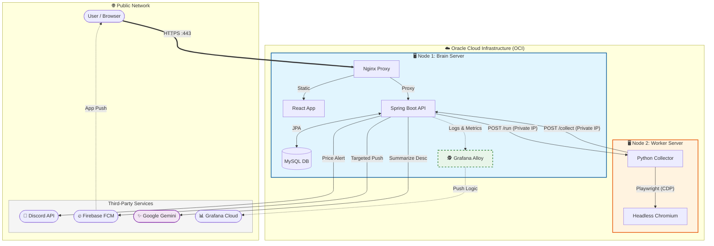

# 🎮 PS-Tracker (PlayStation Store Intelligence Platform)

**Spring Boot와 Docker 기반의 플레이스테이션 스토어 가격 추적 및 AI 추천 서비스**

[](https://ps-signal.com)
[](LICENSE)

## 1. 프로젝트 소개 (Introduction)
**PS-Tracker**는 매일 변동하는 플레이스테이션 스토어의 게임 가격 정보를 수집하고, 사용자에게 최적의 구매 시점을 안내하는 개인화 서비스입니다.

단순한 크롤링 프로젝트를 넘어, **"제한된 리소스(1GB RAM) 환경에서 고가용성 서비스를 구축하는 것"**을 목표로 했습니다. MSA(Microservices Architecture)의 개념을 도입하여 수집 노드와 API 노드를 분리하였고, 데이터 수집부터 배포, 모니터링까지 전 과정을 자동화하여 1인 개발의 운영 효율을 극대화했습니다.

* **개발 기간:** 2025.11 ~ 2026.01 (진행 중)
* **개발 인원:** 1인 (Full Stack & DevOps)
* **주요 역할:**
  * **Backend:** Spring Boot 기반의 REST API 설계 및 비즈니스 로직 구현
  * **Infra:** Docker 컨테이너 설계 및 Oracle Cloud 기반의 분산 서버 구축
  * **Data:** Python/Playwright를 활용한 동적 크롤링 파이프라인 및 데이터 정규화

---

## 2. 핵심 기술 성과 (Key Engineering Achievements)

### 🚀 자동화 및 아키텍처 (Automation & Architecture)
* **이원화된 노드 아키텍처:** 메모리 부족(OOM) 문제를 해결하기 위해 **API 서버(Brain)** 와 **수집 서버(Hand)** 를 물리적으로 분리하고, 사설망(Private Network)을 통해 통신하도록 설계하여 안정성 확보.
* **스마트 수집 파이프라인:** 무조건적인 `INSERT`를 지양하고, 기존 데이터와 비교하여 **'유의미한 변동(가격, 할인 조건)'이 있을 때만 DB에 저장**하는 로직(Smart Upsert)을 구현하여 데이터 낭비 방지.
* **CD 파이프라인 자동화 (Automated CD Pipeline):** GitHub Actions를 활용하여 코드 푸시부터 배포까지 전 과정을 자동화.

### 💎 데이터 처리 및 성능 (Data & Performance)
* **수집 성능 개선 :** 기존 HTTP 기반(Selenium) 통신 방식을 **WebSocket 기반(Playwright)** 으로 전면 교체하여, 통신 오버헤드를 제거하고 수집 속도를 개선 (3분 → 30~50초).
* **네트워크 레벨 리소스 제어:** Playwright의 `Route API`를 활용하여 이미지/폰트 등 불필요한 리소스 요청을 네트워크 단에서 원천 차단(Abort), 1GB RAM 환경에서도 메모리 누수 없는 안정성 확보.
* **동적 쿼리 엔진 (QueryDSL):** 복잡한 필터링(가격, IGDB스코어, 할인율 등)과 스냅샷 조회(Latest Price)를 위해 Type-Safe한 QueryDSL을 도입, 런타임 에러 방지 및 조회 성능 최적화.
* **경량 에이전트 도입 :** 1GB RAM 환경에서도 부담 없는 **Grafana Alloy** 에이전트를 도입하여 리소스 점유율을 최소화하면서도 PLG(Prometheus, Loki, Grafana) 스택을 구축.
* **역정규화 패턴 :** 1:N 관계의 가격 이력 테이블 조인으로 인한 조회 성능 저하를 해결하기 위해, 검색용 필드(현재가, 할인율 등)를 메인 테이블로 역정규화하여 **조인 비용(Join Cost)을 제거**하고 검색 속도를 개선.
* **OS 레벨 프로세스 제어 :** Docker 컨테이너 환경의 `PID 1` 좀비 프로세스(`defunct`) 문제를 해결하기 위해 Tini(`init: true`) 프로세스를 도입하고, 1GB RAM 한계를 극복하기 위해 엔진 생명주기를 배치 단위로 엄격하게 관리하여 메모리 누수 및 스왑 현상 방지.

### 🛡️ 보안 및 사용자 인프라 (Security & Infrastructure)
* **보안 중심 인증:** XSS 공격 방지를 위해 JWT를 `LocalStorage`가 아닌 **HttpOnly Cookie**에 저장하고, CSRF 방어를 위해 `SameSite=Lax` 전략 적용.
* **인프라 계층 방어:** Cloudflare 프록시를 도입하여 실제 서버 IP를 은닉하고, **봇 파이트 모드(Bot Fight Mode)** 및 **AI 미궁(AI Labyrinth)** 설정을 통해 악성 스크래퍼의 자원 점유를 차단하여 1GB RAM 서버의 가용성 확보.
* **리소스 남용 방지:** **핫링크 보호(Hotlink Protection)** 를 적용하여 외부 사이트의 이미지 무단 링크를 차단함으로써 불필요한 대역폭 낭비를 막고 서버 부하를 최소화.
* **게이미피케이션:** 단순 가격 정보 제공을 넘어 가성비를 수치화한 **'전투력 측정기'** 와 가격 변동을 색상으로 표현한 **'가격 신호등'** 기능을 구현하여 사용자 몰입도 증대.

---

## 3. 시스템 아키텍처 (System Architecture)

단일 서버의 리소스 한계(1GB RAM)를 극복하고 안정성을 확보하기 위해, **역할별로 물리적 서버를 분리한 이원화 아키텍처(Dual-Node Strategy)**를 채택했습니다.



### 🏗️ 인프라 구성 (Infrastructure Topology)

| 구분 | Node 1: Main Server (API/DB) | Node 2: Worker Server (Crawler) |
| :--- | :--- | :--- |
| **역할** | 비즈니스 로직 처리, 데이터 저장, 웹 호스팅 | 리소스 집약적 작업(Headless Browser) 수행 |
| **IP 주소** | `10.0.0.161` (Private) | `10.0.0.61` (Private) |
| **Tech Stack** | Java 17 (Spring Boot), MySQL 8.0, Nginx, React | Python 3.10, Playwright (Chromium), Manual Stealth |
| **포트 정책** | `80/443` (Public), `8080/3306` (Private Only) | `5000/4444` (Private Only, 외부 접근 차단) |

> **💡 핵심 전략: 리소스 격리 (Resource Isolation)**
> 메모리 점유율이 높은 **Playwright(Chromium)** 과 **데이터베이스(MySQL)** 가 서로의 자원을 침범하여 서버가 다운되는 현상(OOM)을 방지하기 위해 물리적으로 격리했습니다.

### 🔐 네트워크 보안 (Network Security)
외부 공격 표면(Attack Surface)을 최소화하기 위해 철저한 **폐쇄형 네트워크 정책**을 적용했습니다.

1.  **Private Network Communication:** Node 1과 Node 2는 오직 오라클 클라우드(OCI) 내부망(VCN)을 통해서만 통신합니다. 크롤링 서버(Node 2)는 공인 IP(Public IP)로의 접근을 원천 차단했습니다.
2.  **Port Hardening:** Nginx(80, 443)를 제외한 모든 애플리케이션 포트(DB, API, Crawler)는 도커 바인딩을 `127.0.0.1`로 제한하거나 방화벽(iptables)으로 차단했습니다.

### 🔄 데이터 파이프라인 (Data Pipeline)

안정적인 데이터 수집과 처리를 위한 순환 구조입니다.

1.  **Trigger (Scheduler):** Spring Boot의 스케줄러가 매일 새벽 크롤링 서버(Node 2)에 작업 명령(`POST /run`)을 전송합니다.
2.  **Collection (Python Worker):** Python 서버가 Playwright를 통해 브라우저를 제어합니다. 이때, 화면 렌더링을 기다리지 않고 **JSON 모델 데이터**를 즉시 추출합니다.
3.  **Filtering (Java Logic):** 수집된 데이터는 다시 메인 서버(Node 1)로 전송되며, `CatalogService`가 기존 데이터와 비교하여 **변동이 발생한 건만 선별**합니다.
4.  **Persistence (MySQL):** 선별된 데이터만 DB에 저장(Smart Upsert)하여 데이터 용량을 최적화합니다.
5.  **Notification (Event):** 가격 하락이 감지되면 비동기 이벤트(`GamePriceChangedEvent`)가 발행되어 Web Push 알림을 발송합니다.

---

## 4. 핵심 구현 기술 (Core Implementation Details)

데이터의 정합성을 보장하고, 한정된 시스템 리소스를 효율적으로 사용하기 위한 주요 기술적 접근 방식입니다.

### 🧠 Backend Strategy (Java & Spring Boot)

**1. 조건부 영속성 및 데이터 최적화 (Conditional Persistence)**
* **Problem:** 매일 크롤링을 수행할 때마다 무조건 `INSERT`를 수행하면, 중복 데이터로 인해 DB 용량이 급증하고 조회 성능이 저하되는 문제 발생.
* **Solution:** `CatalogService` 내에 비즈니스 로직(`isSameCondition`)을 구현하여, 이전 데이터와 비교했을 때 **유의미한 변동(가격, 할인율, 세일 종료일 등)이 있는 경우에만 저장**하도록 설계. 이를 통해 **데이터 적재량을 80% 이상 절감**하고 조회 성능을 유지.

**2. 이벤트 기반 아키텍처 (Event-Driven Architecture)**
* **Implementation:** 가격 변동과 알림 발송 로직 간의 강한 결합(Coupling)을 끊기 위해 `ApplicationEventPublisher`를 도입.
* **Benefit:** 가격 저장 로직(Core)과 알림 전송 로직(Side Effect)을 분리하여, 알림 전송 중 예외가 발생하더라도 데이터 저장에는 영향을 주지 않도록 **관심사를 분리(Separation of Concerns)**.

**3. Type-Safe 동적 쿼리 엔진 (QueryDSL)**
* **Complex Search:** 가격 범위, IGDB스코어, 장르 등 N개의 복합 필터링 조건을 처리하기 위해 `BooleanBuilder` 기반의 동적 쿼리 구현.
* **Snapshot Optimization:** 1:N 관계인 가격 히스토리 테이블에서 **'각 게임별 가장 최근 가격'**만을 조회해야 하는 문제(Greatest-N-per-Group)를 해결하기 위해, `JPAExpressions` 서브쿼리를 활용한 최적화된 조인 로직 적용.

---

### 🔐 인증 및 보안 (Auth & Security)
* **Full Cookie Strategy:** 보안성(XSS 방어)과 생산성을 위해 Access/Refresh Token을 모두 **HttpOnly Cookie**에 저장하는 전략 채택.
* **Silent Refresh:** 프론트엔드 개입 없이 API 호출 실패(401) 시 자동으로 토큰을 갱신하는 인터셉터 구현.

👉 **[인증 시스템 구축 가이드 (AUTH_GUIDE.md)](docs/AUTH_GUIDE.md)**

### 🤖 외부 서비스 연동 (External Services)
* **Google Gemini:** `gemini-2.5-flash` 모델을 사용하여 게임 설명을 3줄로 요약 (일일 배치 처리).
* **FCM & Discord:** 가격 하락 시 사용자에게는 웹 푸시를, 운영자에게는 디스코드 알림을 비동기(`@Async`)로 발송.

👉 **[외부 서비스 연동 가이드 (EXTERNAL_SERVICES.md)](docs/EXTERNAL_SERVICES.md)**

### 📡 관측성 (Observability)
* **PLG Stack:** Grafana Alloy(수집) → Grafana Cloud(저장/시각화) → Discord(알림) 파이프라인.
* **GA4 Integration:** SPA 환경에서의 페이지뷰 누락 문제를 해결하기 위해 `History API` 기반의 커스텀 트래커 구현.

👉 **[관측성 및 모니터링 가이드 (OBSERVABILITY.md)](docs/OBSERVABILITY.md)**

### 🔐 보안 및 배포 전략 (Deployment & Security)
* **Network Hardening:** 내부망(Private IP) 통신 및 포트 바인딩 제한(`127.0.0.1`)을 통한 공격 표면 최소화.
* **Build/Run Separation:** React의 빌드 타임 변수 주입(`ARG`)과 백엔드의 런타임 주입(`ENV`)을 분리한 CI/CD 파이프라인.

👉 **[배포 및 인프라 상세 가이드 (DEPLOYMENT.md)](docs/DEPLOYMENT.md)**

---

### 🕸️ Data Engineering (Python & Playwright)

**1. 아키텍처 전환을 통한 성능 혁신 (Selenium → Playwright)**
* **Challenge:** Selenium의 JSON Wire Protocol(HTTP) 방식은 통신 딜레이가 크고, 저사양 환경에서 브라우저 제어가 불안정하여 건당 3분 이상의 수집 시간 소요.
* **Solution:** 브라우저 내부 프로토콜(CDP)에 WebSocket으로 직접 연결하는 Playwright를 도입.
* **Result:** 불필요한 통신 대기 시간을 없애고 건당 30~50초 내외로 수집 속도를 단축했으며, `wait_until='commit'` 전략을 통해 로딩 병목 현상 해결.

**2. 탐지 회피 (Manual Stealth Strategy)**
* **Technique:** 무거운 서드파티 라이브러리(`undetected-chromedriver`) 대신, `navigator.webdriver` 속성을 제거하는 경량화된 스크립트 주입(Script Injection) 방식을 적용하여 봇 탐지 솔루션을 효율적으로 우회.

**3. 메모리 수명 주기 관리 (Resource Lifecycle Management)**
* **Challenge:** 1GB RAM 환경에서 Headless Chrome을 장시간 유지할 경우, 메모리 누적과 스레드 부족으로 인해 `RuntimeError: can't start new thread` 발생 및 프로세스 중단.
* **Solution:** **'Periodic Context Refresh'** 전략을 적용하여 브라우저 리소스를 주기적으로 초기화.
  * **Implementation:** 수집 10건(Batch Size)마다 브라우저 컨텍스트를 닫고(`close`) 변수를 초기화(`None`)한 뒤, `gc.collect()`를 호출하여 점유 메모리를 즉시 반환.
  * **Phase 2 (탐색):** 한 페이지(24개) 내에서도 10개 단위로 끊어서 리소스를 정리함으로써, 일시적인 메모리 스파이크로 인한 강제 종료 방지.
* **Result:** 1GB 메모리 한계 내에서 스왑(Swap) 사용을 최소화하고, 수집 프로세스가 에러 없이 끝까지 완료되도록 **운영 안정성(Stability)** 확보.

---

## 5. 트러블 슈팅 (Troubleshooting & Lessons)

개발 과정에서 마주친 주요 기술적 난관과 해결 과정입니다. 더 자세한 25가지의 전체 트러블 슈팅 로그는 [별도 문서(docs/TROUBLESHOOTING.md)](docs/TROUBLESHOOTING.md)에서 확인하실 수 있습니다.

### 🔥 Case 1. 저사양 환경에서의 리소스 충돌과 OOM (Architecture)
* **Problem:** 1GB RAM(Oracle Cloud Free Tier) 환경에서 Spring Boot(API), MySQL(DB), Selenium(Chrome)을 단일 컨테이너 환경으로 실행하자, 크롤링 시작 직후 메모리 부족으로 인한 **OOM Killer**가 발생하여 DB 프로세스가 강제 종료됨.
* **Analysis:** Chrome 브라우저 인스턴스가 실행될 때 순간적으로 메모리 스파이크가 발생하며, 힙 메모리를 점유하고 있던 JVM 및 MySQL과 경합(Contention) 발생.
* **Solution (Architecture Separation):** 물리적 서버를 **'Main Node(API/DB)'** 와 **'Worker Node(Crawler)'** 로 분리하는 이원화 아키텍처 도입.
  * **Node 1:** 메모리 사용량이 일정한 API와 DB를 배치하여 안정성 확보.
  * **Node 2:** 리소스 변동 폭이 큰 크롤러를 별도 서버로 격리하여, 수집 장애가 메인 서비스에 영향을 주지 않도록 차단.
  * **Result:** 시스템 가용성(Uptime) 확보 및 메모리 사용률 안정화.

### 🚀 Case 2. 성능 한계 돌파: Selenium에서 Playwright로의 여정 (Architecture)
* **Problem:** 초기에는 `Selenium`을 사용하여 JSON 데이터를 추출하는 방식을 사용했으나, **HTTP 기반 통신(JSON Wire Protocol)** 의 태생적 한계로 인해 페이지당 3초 이상의 딜레이가 발생했고, 1GB RAM 환경에서 브라우저 프로세스가 자주 멈추는(Freezing) 현상을 겪음.
* **Analysis:**
  1. **통신 오버헤드:** Selenium은 명령마다 HTTP 요청을 보내야 하므로 네트워크 비용이 높음.
  2. **리소스 제어 불가:** 불필요한 이미지/폰트 로딩을 완벽하게 차단하기 어려워 메모리 낭비가 심함.
* **Solution (Engine Migration):** 브라우저와 **WebSocket(CDP)**으로 직접 통신하는 **Playwright**로 엔진을 전면 교체.
  * **Network Interception:** `Route API`를 사용하여 이미지와 미디어 요청을 브라우저 도달 전 **0ms에 차단(Abort)**.
  * **Wait Strategy:** `wait_until='commit'` 전략을 적용하여 불필요한 렌더링 대기 시간을 제거.
* **Result:** 수집 속도 (3분 → 30~50초) 및 메모리 사용량 50% 절감 달성.

### 🏭 Case 3. Docker 빌드 타임 vs 런타임 변수 주입 (DevOps)
* **Problem:** 로컬 개발 환경(`.env`)에서는 정상 작동하던 React 앱이, GitHub Actions를 통해 배포된 후에는 환경변수(Firebase Config)를 읽지 못하는(`undefined`) 오류 발생.
* **Analysis:** Docker Compose의 `env_file`은 컨테이너가 실행되는 **런타임(Run-Time)**에 OS 환경변수를 주입함. 반면, React(Vite)와 같은 정적 웹사이트는 소스 코드가 컴파일되는 **빌드 타임(Build-Time)**에 변수가 주입되어야 함.
* **Solution:** CI/CD 파이프라인을 재설계하여 변수 주입 시점을 분리.
  * **Frontend:** Dockerfile에 `ARG`를 선언하고, GitHub Actions 빌드 단계에서 `--build-arg` 옵션으로 Secrets를 주입하여 정적 파일에 값을 구워냄(Hard-coding).
  * **Backend:** 민감한 정보(DB Password 등)는 운영 서버의 `.env` 파일을 통해 런타임에 주입되도록 이원화.

👉 **[전체 트러블 슈팅 로그 (25건) 보러가기](docs/TROUBLESHOOTING.md)**

---

## 6. 기술 스택 (Tech Stack)

| 구분 | 기술 스택                                                                             |
| :--- |:----------------------------------------------------------------------------------|
| **Backend** | Java 17, Spring Boot 3.5, Spring Security, JPA/QueryDSL, Gradle, JUnit 5, Mockito |
| **Frontend** | React 19, TypeScript, Tailwind CSS, Vite, Axios                                   |
| **Data & Core** | Python 3.10, Playwright, Manual Stealth (JS Injection)                            |
| **Database** | MySQL 8.0 (Prod/Local 분리)                                                         |
| **Infra & DevOps** | Oracle Cloud (ARM/AMD), Docker & Compose, Nginx, GitHub Actions                   |
| **Monitoring** | Grafana Alloy, Grafana Cloud (Dashboard)                                          |
| **External API** | Google Gemini 2.5 Flash, IGDB API, Discord Webhook, Firebase (FCM)                |
| **Cache** | Caffeine (Local Cache for 1GB RAM Environment)                                    |

## 7. 실행 방법 (Getting Started)

로컬 개발 환경에서 프로젝트를 실행하는 방법입니다.

### Prerequisites
* Docker & Docker Compose
* Java 17+ (for local logic dev)
* Node.js 20+ (for frontend dev)

환경에 따라 **로컬 개발(통합)** 모드와 **운영 서버(분산)** 모드로 나누어 실행

### 🏠 A. 로컬 개발 환경 (Local Development)
개발 편의성을 위해 **Brain(Java/DB)과 Hand(Crawler)를 하나의 도커 컴포즈로 통합**하여 실행

**1. Run All Services 로컬 전용 통합 설정 파일을 사용**
```bash
docker compose -f docker-compose-local-dev.yml up -d --build
```

**2. 접속 확인**
- Service URL: `http://localhost:8080` (API), `http://localhost` (Web)
- Crawler Log: `docker logs ps-tracker-collector` (Playwright Headless)
- DB Admin: `http://localhost:8090` (Adminer)

---

### ☁️ B. 운영 서버 환경 (Production - Distributed)
리소스 효율과 안정성을 위해 **Brain(Node 1)**과 **Hand(Node 2)**로 역할을 분리하여 배포

**① Node 1: Brain Server (10.0.0.161)**
- 역할: API Hosting, Database, Frontend, Alloy Monitoring
```bash
# Run Brain Services
docker compose -f docker-compose.brain.yml up -d --build
```

**② Node 2: Hand Server (10.0.0.61)**
- 역할: Playwright Browser, Python Collector
```bash
# Run Hand Services
docker compose -f docker-compose.hand.yml up -d --build
```

**③ Internal Communication Check**
- 1호기(Brain)에서 2호기(Hand)로 크롤링 명령이 정상적으로 가는지 테스트합니다. (사설 IP 통신)
```bash
# Node 1 터미널에서 실행
curl -X POST [http://10.0.0.61:5000/run](http://10.0.0.61:5000/run)
```

### 🕹️ 수동 크롤링 트리거 (API)
운영 중인 서버에서 즉시 수집을 시작하고 싶다면 외부 API를 호출(관리자 권한 필요)
- URL: https://ps-signal.com/api/v1/games/manual-crawl
- Method: POST
- Header: Authorization: Bearer {ADMIN_ACCESS_TOKEN}

### 🧪 테스트 실행 (Run Tests)
작성된 단위/통합 테스트를 수행하여 로직의 건전성을 검증합니다.
```bash
./gradlew test
```

---

## 9. 향후 계획 (Future Roadmap)
단순 기능 구현을 넘어, **서비스의 지속 가능성(Sustainability)** 과 **품질(Quality)** 을 높이는 데 집중하고 있습니다.

### ✅ Phase 1. 서비스 안정화 (Completed)
- [x] 이원화 아키텍처(Brain/Hand) 구축을 통한 리소스 격리
- [x] Google Gemini API 연동을 통한 게임 설명 요약 (Daily Batch)
- [x] Github Actions & Docker 기반 CI/CD 파이프라인 구축

### 🚧 Phase 2. 신뢰성 및 성능 (In Progress)

단순한 기능 추가보다, 서비스의 내실을 다지고 트래픽 증가에 대비한 확장성 확보에 집중하고 있습니다.

* [x] **코드 신뢰성 확보 (Test Coverage):**
  * **Core Logic:** JUnit 5 & Mockito를 도입하여 `CatalogService`의 핵심 로직(Smart Upsert, 가격 변동 감지, 0원 방어) 검증 완료.
  * **Event Listener:** `GamePriceChangedListener`의 알림 발송 및 예외 처리 로직에 대한 단위 테스트 작성.
  * **CI Integration:** Docker 빌드 파이프라인에 테스트 단계를 강제하여 배포 전 회귀 버그(Regression Bug) 차단.

* [X] **전략적 캐싱 레이어 구축 (Performance vs Scalability):**
  * **Target:** DB I/O가 빈번하게 발생하는 '게임 상세 정보' 및 '장르별 목록' 조회 성능 최적화.
  * **Abstraction First:** Spring Cache 추상화(`@Cacheable`)를 적용하여 비즈니스 로직과 캐시 구현체(Store) 간의 의존성 분리.
  * **Local-First Strategy:** 현재의 단일 인스턴스 및 1GB RAM 제약을 고려하여, 네트워크 비용(Network I/O)이 없는 **Caffeine(Local Cache)** 을 우선 적용해 응답 속도 극대화.
  * **Redis-Ready:** 추후 다중 인스턴스 확장(Scale-out) 시, 코드 수정 없이 설정 변경만으로 **Redis(Global Cache)**로 전환 가능한 유연한 아키텍처 검증.
