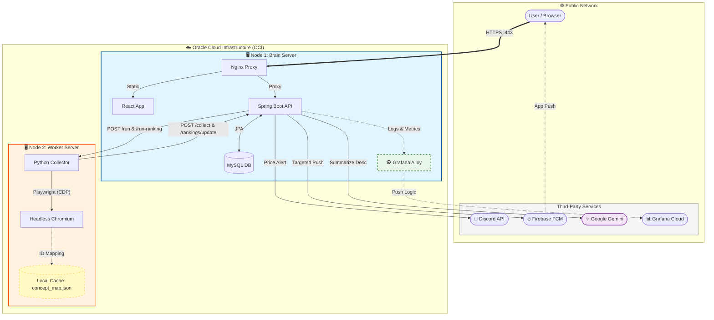

# 🎮 PS-Tracker (PlayStation Store Intelligence Platform)

**Spring Boot와 Docker 기반의 플레이스테이션 스토어 가격 추적 및 AI 추천 서비스**

[](https://ps-signal.com)
[](LICENSE)

## 1. 프로젝트 소개 (Introduction)
**PS-Tracker**는 매일 변동하는 플레이스테이션 스토어의 게임 가격 정보를 수집하고, 사용자에게 최적의 구매 시점을 안내하는 개인화 서비스입니다.

단순한 크롤링 프로젝트를 넘어, **"제한된 리소스(1GB RAM) 환경에서 고가용성 서비스를 구축하는 것"** 을 목표로 했습니다. MSA(Microservices Architecture)의 개념을 도입하여 수집 노드와 API 노드를 분리하였고, 데이터 수집부터 배포, 모니터링까지 전 과정을 자동화하여 1인 개발의 운영 효율을 극대화했습니다.

* **개발 기간:** 2025.11 ~ (운영 중)
* **개발 인원:** 1인 (Full Stack & DevOps)
* **주요 역할:**
  * **Backend:** Spring Boot 기반의 REST API 설계 및 비즈니스 로직 구현
  * **Infra:** Docker 컨테이너 설계 및 Oracle Cloud 기반의 분산 서버 구축
  * **Data:** Python/Playwright를 활용한 동적 크롤링 파이프라인 및 데이터 정규화

---

## 핵심 서비스 기능 (Key Features)
단순한 데이터 나열을 넘어, 게이머의 구매 결정을 돕는 **'큐레이션(Curation)'** 과 **'게이미피케이션(Gamification)'** 에 집중했습니다.

* **역대 가격 추적 및 차트 시각화 (Price Tracking & History):** 
  * 매일 수집되는 데이터를 바탕으로 게임별 역대 가격 변동 내역을 차트로 시각화하여, 현재 할인이 진짜 '역대가'인지 한눈에 파악할 수 있게 돕습니다.
* **스마트 찜하기 및 맞춤형 푸시 알림 (Smart Wishlist & Alert):** 
  * 유저가 설정한 '목표가' 도달 시 웹 푸시(FCM)를 발송하며, 야간 방해금지 및 수신 채널 제어 등 개인화 설정을 지원합니다.
* **공식 스토어 인기 랭킹 연동 (Store Rankings):** 
  * 소니 공식 스토어의 '베스트셀러', '최다 다운로드' 랭킹 데이터를 매일 배치(Batch)로 수집·통합하여 게이머들에게 정확한 소비 트렌드를 제공합니다.
* **심층 큐레이션 및 스마트 복합 필터 (Deep Curation):** 
  * '역대 최저가', 'IGDB 85점 이상 명작', 'PS5 Pro 향상' 등 게이머의 니즈를 정확히 찌르는 복합 필터링을 지원합니다.
* **데이터 인사이트 및 유저 참여형 신작 발굴 (Insights & Discover):** 
  * 스토어에 갓 등록된 미분류 신작을 매일 자동 수집하며, **유저가 직접 숨겨진 게임을 발굴(Unlock)해 정식 트래킹 카탈로그로 편입시키는 '유저 참여형 파이프라인'** 을 구축했습니다. 누적된 스토어 통계 데이터는 벤토 박스(Bento) UI를 통해 직관적으로 제공합니다.

---

## 2. 핵심 기술 성과 (Key Engineering Achievements)

### 🚀 자동화 및 아키텍처 (Automation & Architecture)
* **이원화된 노드 아키텍처:** 메모리 부족(OOM) 문제를 해결하기 위해 **API 서버(Brain)** 와 **수집 서버(Hand)** 를 물리적으로 분리하고, 사설망(Private Network)을 통해 통신하도록 설계하여 안정성 확보.
* **스마트 수집 파이프라인:** 무조건적인 `INSERT`를 지양하고, 기존 데이터와 비교하여 **'유의미한 변동(가격, 할인 조건)'이 있을 때만 DB에 저장**하는 조건부 병합(Smart Upsert)로직을 구현하여 데이터 낭비 방지.
* **CD 파이프라인 자동화 (Automated CD Pipeline):** GitHub Actions를 활용하여 코드 푸시부터 배포까지 전 과정을 자동화.

### 💎 데이터 처리 및 성능 (Data & Performance)
* **수집 성능 개선 :** 기존 HTTP 기반(Selenium) 통신 방식을 **WebSocket 기반(Playwright)** 으로 전면 교체하여, 통신 오버헤드를 제거하고 수집 속도를 개선 (3분 → 30초 내외).
* **네트워크 레벨 리소스 제어:** Playwright의 `Route API`를 활용하여 이미지/폰트 등 불필요한 리소스 요청을 네트워크 단에서 원천 차단(Abort), 1GB RAM 환경에서도 메모리 누수 없는 안정성 확보.
* **동적 쿼리 엔진 (QueryDSL):** 복잡한 필터링(가격, IGDB스코어, 할인율 등)과 스냅샷 조회(Latest Price)를 위해 Type-Safe한 QueryDSL을 도입, 런타임 에러 방지 및 조회 성능 최적화.
* **경량 에이전트 도입 :** 1GB RAM 환경에서도 부담 없는 **Grafana Alloy** 에이전트를 도입하여 리소스 점유율을 최소화하면서도 PLG(Prometheus, Loki, Grafana) 스택을 구축.
* **역정규화 패턴 :** 1:N 관계의 가격 이력 테이블 조인으로 인한 조회 성능 저하를 해결하기 위해, 검색용 필드(현재가, 할인율 등)를 메인 테이블로 역정규화하여 **조인 비용(Join Cost)을 제거**하고 검색 속도를 개선.
* **OS 레벨 프로세스 제어 :** Docker 컨테이너 환경의 `PID 1` 좀비 프로세스(`defunct`) 문제를 해결하기 위해 Tini(`init: true`) 프로세스를 도입하고, 1GB RAM 한계를 극복하기 위해 엔진 생명주기를 배치 단위로 엄격하게 관리하여 메모리 누수 및 스왑 현상 방지.

### 🛡️ 보안 및 사용자 인프라 (Security & Infrastructure)
* **보안 중심 인증:** XSS 공격 방지를 위해 JWT를 `LocalStorage`가 아닌 **HttpOnly Cookie**에 저장하고, CSRF 방어를 위해 `SameSite=Lax` 전략 적용.
* **인프라 계층 방어:** Cloudflare 프록시를 도입하여 실제 서버 IP를 은닉하고, **봇 파이트 모드(Bot Fight Mode)** 및 **AI 미궁(AI Labyrinth)** 설정을 통해 악성 스크래퍼의 자원 점유를 차단하여 1GB RAM 서버의 가용성 확보.
* **리소스 남용 방지:** **핫링크 보호(Hotlink Protection)** 를 적용하여 외부 사이트의 이미지 무단 링크를 차단함으로써 불필요한 대역폭 낭비를 막고 서버 부하를 최소화.
* **게이미피케이션:** 단순 가격 정보 제공을 넘어 가성비를 수치화한 **'전투력 측정기'** 와 가격 변동을 색상으로 표현한 **'가격 신호등'** 기능을 구현하여 사용자 몰입도 증대.

---

## 3. 시스템 아키텍처 (System Architecture)

단일 서버의 리소스 한계(1GB RAM)를 극복하고 안정성을 확보하기 위해, **역할별로 물리적 서버를 분리한 이원화 아키텍처(Dual-Node Strategy)**를 채택했습니다.


```mermaid
graph TD
    %% --- [External Network] ---
    subgraph Public_Network ["🌐 Public Network"]
        User([User / Browser])
        
        subgraph External_Services ["Third-Party Services"]
            Discord([🔔 Discord API])
            FCM([🔥 Firebase FCM])
            Gemini([✨ Google Gemini])
            Grafana([📊 Grafana Cloud])
        end
    end

    %% --- [Oracle Cloud Infrastructure] ---
    subgraph Oracle_Cloud ["☁️ Oracle Cloud Infrastructure (OCI)"]
        
        %% Node 1: Brain (Main Server)
        subgraph Node_1 ["🖥️ Node 1: Brain Server"]
            Nginx[Nginx Proxy]
            Front[React App]
            SB[Spring Boot API]
            MySQL[(MySQL DB)]
            Alloy[🕵️ Grafana Alloy]
        end

        %% Node 2: Hand (Worker Server)
        subgraph Node_2 ["🖥️ Node 2: Worker Server"]
            Py[Python Collector]
            Browser[Headless Chromium]
            Cache[(Local Cache: concept_map.json)]
        end

        %% --- [Connections: Inbound] ---
        User ==>|HTTPS :443| Nginx
        Nginx -->|Static| Front
        Nginx -->|Proxy| SB
        
        %% --- [Connections: Internal Logic] ---
        SB <-->|JPA| MySQL
        
        %% Private Network Communication (Brain <-> Hand)
        SB --"POST /run & /run-ranking"--> Py
        Py --"Playwright (CDP)"--> Browser
        Browser -.->|ID Mapping| Cache
        Py --"POST /collect & /rankings/update"--> SB

        %% --- [Connections: Outbound / Observability] ---
        SB -.->|Logs & Metrics| Alloy
        Alloy -.->|Push Logic| Grafana
        
        %% --- [Connections: External APIs] ---
        SB --"Price Alert"--> Discord
        SB --"Targeted Push"--> FCM
        SB --"Summarize Desc"--> Gemini
        FCM -.->|App Push| User
    end

    %% --- [Styling] ---
    style Node_1 fill:#e1f5fe,stroke:#01579b,stroke-width:2px
    style Node_2 fill:#fff3e0,stroke:#e65100,stroke-width:2px
    style Cache fill:#fff9c4,stroke:#fbc02d,stroke-width:1px,stroke-dasharray: 5 5
    style Alloy fill:#e8f5e9,stroke:#2e7d32,stroke-width:2px,stroke-dasharray: 5 5
    style External_Services fill:#f5f5f5,stroke:#9e9e9e,stroke-width:1px
    style Gemini fill:#f3e5f5,stroke:#7b1fa2,stroke-width:1px
```

### 🏗️ 인프라 구성 (Infrastructure Topology)

| 구분 | Node 1: Main Server (API/DB) | Node 2: Worker Server (Crawler) |
| :--- | :--- | :--- |
| **역할** | 비즈니스 로직 처리, 데이터 저장, 웹 호스팅 | 리소스 집약적 작업(Headless Browser), 랭킹 수집 |
| **IP 주소** | `10.0.0.161` (Private) | `10.0.0.61` (Private) |
| **Tech Stack** | Java 17 (Spring Boot), MySQL 8.0, Nginx, React | Python 3.10, Playwright, Local Cache (JSON) |
| **포트 정책** | `80/443` (Public), `8080/3306` (Private Only) | `5000/4444` (Private Only, 외부 접근 차단) |

> **💡 핵심 전략: 리소스 격리 (Resource Isolation)**
> 메모리 점유율이 높은 **Playwright(Chromium)** 과 **데이터베이스(MySQL)** 가 서로의 자원을 침범하여 서버가 다운되는 현상(OOM)을 방지하기 위해 물리적으로 격리했습니다.

### 🔐 네트워크 보안 (Network Security)
외부 공격 표면(Attack Surface)을 최소화하기 위해 철저한 **폐쇄형 네트워크 정책**을 적용했습니다.

1.  **Private Network Communication:** Node 1과 Node 2는 오직 오라클 클라우드(OCI) 내부망(VCN)을 통해서만 통신합니다. 크롤링 서버(Node 2)는 공인 IP(Public IP)로의 접근을 원천 차단했습니다.
2.  **Port Hardening:** Nginx(80, 443)를 제외한 모든 애플리케이션 포트(DB, API, Crawler)는 도커 바인딩을 `127.0.0.1`로 제한하거나 방화벽(iptables)으로 차단했습니다.

### 🔄 데이터 파이프라인 (Data Pipeline)

안정적인 데이터 수집과 처리를 위한 순환 구조입니다.

1.  **Trigger (Scheduler):** Spring Boot의 스케줄러가 매일 정해진 시간에 크롤링 서버(Node 2)에 배치 수집 및 랭킹 업데이트 명령(`POST /run`, `/run-ranking`)을 전송합니다.
2.  **Collection (Python Worker):** Python 서버가 Playwright를 통해 데이터를 수집합니다.
    1. Batch Mode: 페이지 내 특정 **데이터 태그(data-qa)** 를 타겟팅하여 가격 및 메타 정보를 정밀 파싱합니다.
    2. Ranking Mode: 스토어 인기 순위 리스트를 스캔하며, **로컬 캐시(concept_map.json)** 를 참조해 불필요한 상세 페이지 호출을 최소화(최적화)합니다.
3.  **Filtering (Java Logic):** 수집된 데이터는 메인 서버(Node 1)로 전송되며, `CatalogService`가 기존 데이터와 비교하여 **변동이 발생한 건(가격, 할인 기간 등)만 선별**합니다.
4.  **Persistence (MySQL):** 선별된 데이터만 DB에 저장(Smart Upsert)하고, 랭킹 정보는 별도의 전용 테이블에 업데이트하여 조회 성능을 최적화합니다.
5.  **Notification (Event):** 가격 하락이 감지되면 비동기 이벤트가 발행되어 Web Push(FCM)를 전송합니다.

---

## 4. 핵심 구현 기술 (Core Implementation Details)

데이터의 정합성을 보장하고, 한정된 시스템 리소스를 효율적으로 사용하기 위한 주요 기술적 접근 방식입니다.

### 🧠 Backend Strategy (Java & Spring Boot)

**1. 조건부 영속성 및 데이터 최적화 (Conditional Persistence)**
* **Problem:** 매일 크롤링을 수행할 때마다 무조건 `INSERT`를 수행하면, 중복 데이터로 인해 DB 용량이 급증하고 조회 성능이 저하되는 문제 발생.
* **Solution:** `CatalogService` 내에 비즈니스 로직(`isSameCondition`)을 구현하여, 이전 데이터와 비교했을 때 **유의미한 변동(가격, 할인율, 세일 종료일 등)이 있는 경우에만 저장**하도록 설계. 이를 통해 **데이터 적재량을 80% 이상 절감**하고 조회 성능을 유지.

**2. 이벤트 기반 아키텍처 (Event-Driven Architecture)**
* **Implementation:** 가격 변동과 알림 발송 로직 간의 강한 결합(Coupling)을 끊기 위해 `ApplicationEventPublisher`를 도입.
* **Benefit:** 가격 저장 로직(Core)과 알림 전송 로직(Side Effect)을 분리하여, 알림 전송 중 예외가 발생하더라도 데이터 저장에는 영향을 주지 않도록 **관심사를 분리(Separation of Concerns)**.

**3. 타입 안정성을 보장하는 동적 쿼리와 역정규화 (QueryDSL & Denormalization)**
* **동적 복합 검색 (Complex Search):** 가격 범위, IGDB스코어, 장르 등 N개의 복합 필터링 조건을 처리하기 위해 `BooleanBuilder` 기반의 동적 쿼리 구현.
* **조인 비용 제로화:** B2C 카탈로그 서비스 특성상 트래픽이 가장 집중되는 '할인 게임 목록' 조회 시, 1:N 관계인 가격 이력 테이블을 매번 조인하여 '최근 가격'과 '역대 최저가'를 계산하는 것은 DB 부하를 유발. 이를 해결하기 위해 메인 엔티티에 필수 검색 필드를 역정규화하여 무거운 조인 연산을 완전히 제거하고 읽기(Read) 성능을 극대화했으며, 데이터 갱신 시점의 도메인 로직을 통해 엔티티간 데이터 정합성을 보장.

**4. 리소스 제약과 데이터 특성을 고려한 2-Tier 로컬 캐싱 및 파이프라인 연동 (Local Cache & Event-Driven Eviction)**
* **Problem:** B2C 카탈로그 서비스 특성상 메인 페이지와 통계(Insights) 페이지는 읽기(Read) 요청이 가장 빈번하지만, 1GB RAM 환경에서는 별도의 외부 캐시 서버(Redis)를 구축하는 것이 불가능(OOM 위험)함. 또한, 게임의 기본 정보는 '일 단위'로 변하지만, 유저의 찜/투표 여부는 '실시간'으로 변하기 때문에 단순한 전체 캐싱(Full Caching)은 데이터 정합성을 훼손함.
* **Solution:** 외부 인프라 의존도를 낮추고 데이터 생명주기(Lifecycle)에 맞춘 하이브리드 캐싱 전략 구축.
  * **초경량 로컬 캐시 (Caffeine Cache):** Spring Boot 내부에 L1 로컬 캐시를 도입하여 DB I/O를 획기적으로 최소화.
  * **정적/동적 데이터 생명주기 분리 (2-Tier Architecture):** 매일 1회 업데이트되는 '게임 메타 정보와 가격 이력'은 `@Cacheable`을 통해 로컬 메모리에 캐싱하고, '유저의 찜/투표 상태' 등 실시간 정보는 API 호출 시점에 DB에서 별도 조회하여 캐시된 객체에 동적으로 조립(`withDynamicData`)하여 반환.
  * **배치 파이프라인 기반의 능동적 캐시 갱신 (Webhook Trigger):** 수집 서버(Worker Node)의 일일 배치가 완전히 종료되는 즉시, 메인 서버(Main Node)의 내부 웹훅 API를 호출하여 인사이트(통계) 캐시를 일괄 무효화 및 재생성. 이를 통해 무거운 통계 쿼리의 DB 부하를 사전에 방지하고, 유저에게 첫 요청(First-hit penalty)부터 지연 없는 최신 데이터를 제공.
---

### 🔐 인증 및 보안 (Auth & Security)
* **전면 쿠키 인증 전략 (Full Cookie):** 보안성(XSS 방어)과 생산성을 위해 Access/Refresh Token을 모두 **HttpOnly Cookie**에 저장하는 전략 채택.
* **무중단 토큰 갱신 (Silent Refresh):** 유저의 페이지 이동이나 개입 없이, API 호출 실패(401) 시 백그라운드에서 자동으로 토큰을 갱신하는 인터셉터 구현.

👉 **[인증 시스템 구축 가이드 (AUTH_GUIDE.md)](docs/AUTH_GUIDE.md)**

### 🤖 외부 서비스 연동 (External Services)
* **AI 게임 설명 (Google Gemini):** `gemini-2.5-flash` 모델을 사용하여 게임 설명을 3줄로 작성 (일일 배치 처리).
* **다채널 비동기 알림 (FCM & Discord):** 가격 하락 시 사용자에게는 웹 푸시를, 운영자에게는 디스코드 알림을 비동기(`@Async`)로 발송.

👉 **[외부 서비스 연동 가이드 (EXTERNAL_SERVICES.md)](docs/EXTERNAL_SERVICES.md)**

### 📡 관측성 (Observability)
* **경량화된 PLG 파이프라인:** 1GB 램 서버의 부하를 최소화하기 위해 Grafana Alloy(수집) → Grafana Cloud(저장/시각화) → Discord(알림)로 이어지는 외부 위임형 모니터링 구축.
* **GA4 Integration:** SPA 환경에서의 페이지뷰 누락 문제를 해결하기 위해 `History API` 기반의 커스텀 라우트 추적기 구현.

👉 **[관측성 및 모니터링 가이드 (OBSERVABILITY.md)](docs/OBSERVABILITY.md)**

### 📦 보안 및 배포 전략 (Deployment & Security)
* **네트워크 공격 표면 최소화:** 서버 간 내부망(Private IP)통신 및 포트 바인딩 제한(`127.0.0.1`)로 제한하여 외부의 직접적인 데이터베이스/내부망 접근을 원천 차단.
* **변수 주입 시점 이원화:** 프론트엔드(React)의 빌드 타임 변수 주입(ARG)과 백엔드의 런타임 주입(ENV)을 명확히 분리하여 보안 정보 노출을 방지하는 CI/CD 파이프라인 설계.

👉 **[배포 및 인프라 상세 가이드 (DEPLOYMENT.md)](docs/DEPLOYMENT.md)**

---

### 🕸️ Data Engineering (Python & Playwright)

**1. 아키텍처 전환을 통한 성능 혁신 (Selenium → Playwright)**
* **Challenge:** Selenium의 JSON Wire Protocol(HTTP) 방식은 통신 딜레이가 크고, 저사양 환경에서 브라우저 제어가 불안정하여 건당 3분 이상의 수집 시간 소요.
* **Solution:** 브라우저 내부 프로토콜(CDP)에 WebSocket으로 직접 연결하는 Playwright를 도입.
* **Result:** 불필요한 통신 대기 시간을 없애고 건당 30초 내외로 수집 속도를 단축했으며, `wait_until='commit'` 전략을 통해 로딩 병목 현상 해결.

**2. 탐지 회피 (Manual Stealth Strategy)**
* **Technique:** 무거운 서드파티 라이브러리(`undetected-chromedriver`) 대신, `navigator.webdriver` 속성을 제거하는 경량화된 스크립트 주입(Script Injection) 방식을 적용하여 봇 탐지 솔루션을 효율적으로 우회.

**3. 메모리 수명 주기 관리 (Resource Lifecycle Management)**
* **Challenge:** 1GB RAM(Oracle Cloud Free Tier) 환경에서 Headless Chrome을 장시간 유지할 경우, 크롬 탭의 힙 메모리 스파이크 및 대용량 HTML 문자열 누적으로 인해 `RuntimeError` 및 OOM(Out of Memory) 프로세스 중단 발생.
* **Solution:** 'OS 및 런타임 레벨의 3중 메모리 방어선' 구축
  * **V8 엔진 힙 제한 (물리적 차단):** Playwright 실행 인자에 `--js-flags="--max-old-space-size=256"` 를 주입하여, 크롬 탭 하나가 256MB 이상의 메모리를 절대 점유하지 못하도록 런타임 레벨에서 강제 제한.
  * **대용량 변수 즉시 소각 (GC 최적화):** `page.content()` 로 불러온 수 MB 단위의 전체 HTML 문자열은 정규식 파싱 직후 파이썬의 `del` 키워드를 사용해 메모리에서 즉시 참조를 끊고 파기하여 가비지 컬렉터(GC)의 부담을 최소화.
  * **주기적 브라우저 환생 (Context Refresh):** 수집 10건(Batch Size)마다 브라우저 컨텍스트를 강제 종료하고 변수를 초기화(`None`)한 뒤 `gc.collect()`를 호출. 이때 고아(Orphan) 좀비 프로세스가 남지 않도록 자원 반환 구조 설계.
* **Result:** 1GB 메모리 한계 내에서 스왑(Swap) 사용을 최소화하고, 수집 프로세스가 에러 없이 끝까지 완료되도록 **운영 안정성(Stability)** 확보.

---

## 5. 트러블 슈팅 (Troubleshooting & Lessons)

개발 과정에서 마주친 주요 기술적 난관과 해결 과정입니다. 더 자세한 25가지의 전체 트러블 슈팅 로그는 [별도 문서(docs/TROUBLESHOOTING.md)](docs/TROUBLESHOOTING.md)에서 확인하실 수 있습니다.

### 🔥 Case 1. 저사양 환경에서의 리소스 충돌과 OOM (Architecture)
* **Problem:** 1GB RAM(Oracle Cloud Free Tier) 환경에서 Spring Boot(API), MySQL(DB), Selenium(Chrome)을 단일 컨테이너 환경으로 실행하자, 크롤링 시작 직후 메모리 부족으로 인한 **OOM Killer**가 발생하여 DB 프로세스가 강제 종료됨.
* **Analysis:** Chrome 브라우저 인스턴스가 실행될 때 순간적으로 메모리 스파이크가 발생하며, 힙 메모리를 점유하고 있던 JVM 및 MySQL과 경합(Contention) 발생.
* **Solution (이원화 아키텍처 도입):** 물리적 서버를 **'Main Node(API/DB)'** 와 **'Worker Node(Crawler)'** 로 분리하여 리소스를 격리.
  * **API/DB 노드:** 메모리 사용량이 일정한 API와 DB를 배치하여 안정성 확보.
  * **크롤러 전용 노드:** 리소스 변동 폭이 큰 크롤러를 별도 서버로 격리하여, 수집 장애가 메인 서비스에 영향을 주지 않도록 차단.
  * **Result:** 시스템 가용성(Uptime) 보장 및 메모리 사용률 안정화.

### 🚀 Case 2. 성능 한계 돌파: Selenium에서 Playwright로의 여정 (Architecture)
* **Problem:** 초기에는 `Selenium`을 사용하여 데이터를 추출했으나, HTTP 기반 통신의 태생적 한계로 인해 페이지당 3초 이상의 네트워크 딜레이가 발생했고, 1GB RAM 환경에서는 브라우저 프로세스가 자주 멈추는(Freezing) 현상을 겪음.
* **Analysis:**
  1. **통신 오버헤드:** Selenium은 브라우저 명령마다 HTTP 요청을 보내야 하므로 네트워크 비용이 높음.
  2. **리소스 제어 불가:** 불필요한 이미지/폰트 로딩을 네트워크 단에서 완벽하게 차단하기 어려워 1GB 램 환경에서 메모리 누수가 심함.
* **Solution (Engine Migration):** 브라우저와 **WebSocket(CDP)** 으로 직접 통신하는 **Playwright**로 엔진을 전면 교체하여 제어권과 속도 확보.
  * **네트워크 요청 원천 차단:** `Route API`를 사용하여 데이터 파싱에 불필요한 이미지, 미디어, 폰트 요청을 브라우저 도달 전 **0ms에 즉시 차단(Abort)**.
  * **렌더링 대기 시간 최적화:** `wait_until='commit'` (DOM이 그려지기 전 네트워크 응답만 받은 상태) 전략을 적용하여 화면이 다 그려질 때까지 기다리는 낭비 시간 제거.
* **Result:** 수집 속도를 단축(3분 → 30초 내외)했으며, Playwright의 세밀한 제어권을 바탕으로 **V8 엔진 힙 메모리 제한 및 명시적 자원 회수(GC)** 가 가능해져 1GB RAM 환경의 Freezing 이슈를 해결.

### 🏭 Case 3. Docker 빌드 타임 vs 런타임 변수 주입 (DevOps)
* **Problem:** 로컬 개발 환경(`.env`)에서는 정상 작동하던 React 앱이, GitHub Actions를 통해 배포된 후에는 환경변수(Firebase Config)를 읽지 못하는(`undefined`) 오류 발생.
* **Analysis:** Docker Compose의 `env_file`은 컨테이너가 실행되는 **런타임(Run-Time)** 에 OS 환경변수를 주입함. 반면, React(Vite)와 같은 정적 웹사이트는 소스 코드가 컴파일되는 **빌드 타임(Build-Time)** 에 변수가 주입되어야 함.
* **Solution:** CI/CD 파이프라인을 재설계하여 환경변수 주입 시점을 분리.
  * **Frontend(빌드 타임 주입):** Dockerfile에 `ARG`를 선언하고, GitHub Actions 빌드 단계에서 `--build-arg` 옵션으로 Secrets를 주입하여 정적 파일에 값을 구워냄(Hard-coding).
  * **Backend(런타임 주입):** 민감한 정보(DB Password 등)는 소스 코드에 남지 않도록 운영 서버의 `.env` 파일을 통해 컨테이너 실행 시점에 주입되도록 이원화.

👉 **[전체 트러블 슈팅 로그 더 보러가기](docs/TROUBLESHOOTING.md)**

---

## 6. 기술 스택 (Tech Stack)

| 구분 | 기술 스택                                                                             |
| :--- |:----------------------------------------------------------------------------------|
| **Backend** | Java 17, Spring Boot 3.5, Spring Security, JPA/QueryDSL, Gradle, JUnit 5, Mockito |
| **Frontend** | React 19, TypeScript, Tailwind CSS, Vite, Axios                                   |
| **Data & Core** | Python 3.10, Playwright, Manual Stealth (JS Injection)                            |
| **Database** | MySQL 8.0 (Prod/Local 분리)                                                         |
| **Infra & DevOps** | Oracle Cloud (ARM/AMD), Docker & Compose, Nginx, GitHub Actions                   |
| **Monitoring** | Grafana Alloy, Grafana Cloud (Dashboard)                                          |
| **External API** | Google Gemini 2.5 Flash, IGDB API, Discord Webhook, Firebase (FCM)                |
| **Cache** | Caffeine (Local Cache for 1GB RAM Environment)                                    |

## 7. 실행 방법 (Getting Started)

로컬 개발 환경에서 프로젝트를 실행하는 방법입니다.

### Prerequisites
* Docker & Docker Compose
* Java 17+ (for local logic dev)
* Node.js 20+ (for frontend dev)

환경에 따라 **로컬 개발(통합)** 모드와 **운영 서버(분산)** 모드로 나누어 실행

### 🏠 A. 로컬 개발 환경 (Local Development)
개발 편의성을 위해 **Brain(Java/DB)과 Hand(Crawler)를 하나의 도커 컴포즈로 통합**하여 실행

**1. Run All Services 로컬 전용 통합 설정 파일을 사용**
```bash
docker compose -f docker-compose-local-dev.yml up -d --build
```

**2. 접속 확인**
- Service URL: `http://localhost:8080` (API), `http://localhost` (Web)
- Crawler Log: `docker logs ps-tracker-collector` (Playwright Headless)
- DB Admin: `http://localhost:8090` (Adminer)

---

### ☁️ B. 운영 서버 환경 (Production - Distributed)
리소스 효율과 안정성을 위해 **Brain(Node 1)**과 **Hand(Node 2)**로 역할을 분리하여 배포

**① Node 1: Brain Server (10.0.0.161)**
- 역할: API Hosting, Database, Frontend, Alloy Monitoring
```bash
# Run Brain Services
docker compose -f docker-compose.brain.yml up -d --build
```

**② Node 2: Hand Server (10.0.0.61)**
- 역할: Playwright Browser, Python Collector
```bash
# Run Hand Services
docker compose -f docker-compose.hand.yml up -d --build
```

**③ Internal Communication Check**
- 1호기(Brain)에서 2호기(Hand)로 크롤링 명령이 정상적으로 가는지 테스트합니다. (사설 IP 통신)
```bash
# Node 1 터미널에서 실행
curl -X POST [http://10.0.0.61:5000/run](http://10.0.0.61:5000/run)
```

### 🕹️ 수동 크롤링 트리거 (API)
운영 중인 서버에서 즉시 수집을 시작하고 싶다면 외부 API를 호출(관리자 권한 필요)
- URL: https://ps-signal.com/api/v1/games/manual-crawl
- Method: POST
- Header: Authorization: Bearer {ADMIN_ACCESS_TOKEN}

### 🧪 테스트 실행 (Run Tests)
작성된 단위/통합 테스트를 수행하여 로직의 건전성을 검증합니다.
```bash
./gradlew test
```