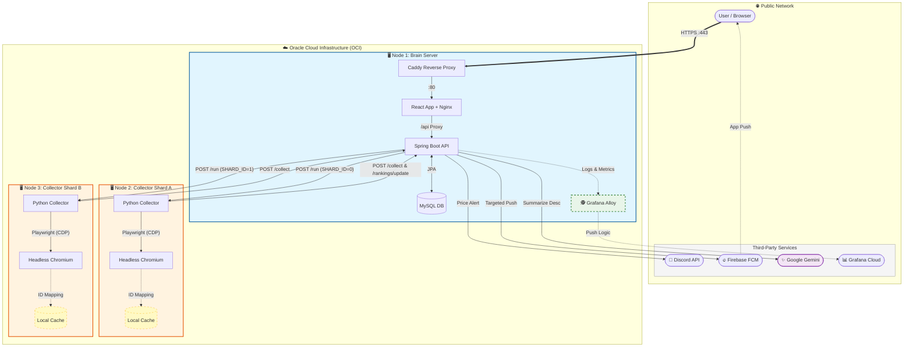

# 🎮 PS-Tracker (PlayStation Store Intelligence Platform)

**Spring Boot와 Docker 기반의 플레이스테이션 스토어 가격 추적 및 알림 서비스**

[](https://ps-signal.com)
[](LICENSE)

## 1. 프로젝트 소개

매일 변동하는 플레이스테이션 스토어의 게임 가격을 수집하고, 목표가 도달 시 사용자에게 웹 푸시를 발송하는 가격 추적·알림 서비스입니다. Oracle Cloud Free Tier(1GB RAM)라는 제약에서 출발하여, MSA 구조·서버 분리·ARM64 업그레이드·크롤러 샤딩까지 인프라를 단계적으로 확장한 운영 중 서비스입니다.

- **개발 기간:** 2025.11 ~ (운영 중)
- **개발 인원:** 1인 (Backend & Infra 중심)

---

## 2. 핵심 서비스 기능

- **역대 가격 추적 및 차트 시각화:** 수집된 가격 이력을 차트로 시각화하여 현재 할인이 역대 최저가인지 비교 가능
- **스마트 찜하기 및 맞춤 푸시 알림:** 목표가 도달 시 FCM 웹 푸시 발송, 야간 방해금지·채널별 수신 설정 지원
- **공식 스토어 인기 랭킹 연동:** 베스트셀러·최다 다운로드 랭킹 데이터를 일 단위 배치로 수집
- **심층 큐레이션 및 복합 필터:** '역대 최저가', 'Metacritic 85점 이상', 'PS5 Pro 향상' 등 복합 조건 필터링
- **유저 참여형 신작 발굴 + 게이미피케이션:** 유저가 미분류 신작을 직접 발굴해 트래킹 카탈로그로 편입. '전투력 측정기', '가격 신호등' 기능으로 구매 판단 지원

---

## 3. 핵심 기술 성과

- 🏗️ **3-Node 샤딩 아키텍처:** 1GB RAM OOM으로 Brain/Hand를 물리 분리(2-Node)한 뒤, SHARD_ID 기반 3호기를 추가해 수집 처리 시간을 절반 수준으로 단축 → [상세](docs/ARCHITECTURE.md)
- ⚙️ **선별적 수집 + 조건부 영속성:** 하루가 지난 게임·할인 종료일 도래 게임만 수집 대상으로 지정하고, 가격·할인 조건에 변동이 있을 때만 DB에 저장하여 불필요한 크롤링과 중복 저장을 방지 → [상세](docs/ARCHITECTURE.md)
- 🔗 **이벤트 기반 알림 분리:** `ApplicationEventPublisher`로 가격 저장 로직과 FCM·Discord 발송 로직을 분리하여, 알림 실패가 데이터 저장에 영향을 주지 않도록 관심사 분리 → [상세](docs/ARCHITECTURE.md)
- 📊 **역정규화 + QueryDSL 동적 쿼리:** 할인 목록 조회의 Greatest-N Join을 역정규화로 제거하고, N개 복합 필터를 `BooleanBuilder` 기반으로 타입 안전하게 처리 → [상세](docs/ARCHITECTURE.md)
- 🧵 **JDK 21 가상 스레드 Fan-out:** 게임 상세 조회 내 독립 I/O 작업을 `CompletableFuture.allOf()`로 병렬 처리. ThreadLocal 비상속 이슈는 QueryDSL DTO 프로젝션 전환으로 해결 → [상세](docs/ARCHITECTURE.md)
- 🗄️ **4-Cache 하이브리드 전략:** Redis 없이 Caffeine Cache 4개로 정적/동적 데이터를 분리 운영, 배치 완료 시 웹훅 기반 일괄 무효화 → [상세](docs/ARCHITECTURE.md)
- 🕷️ **Playwright 수집 엔진:** CDP(WebSocket) 직접 통신 + 네트워크 레벨 리소스 차단 + 배치 단위 브라우저 재시작으로 1GB RAM 환경에서 안정적인 장시간 운영 → [상세](docs/ARCHITECTURE.md)
- 🚀 **멀티 아키텍처 CI/CD:** GitHub Actions + Buildx로 AMD64/ARM64 네이티브 이미지를 동시 빌드·자동 배포 → [DEPLOYMENT.md](docs/DEPLOYMENT.md)

---

## 4. 시스템 아키텍처


```mermaid
graph TD
    %% --- [External Network] ---
    subgraph Public_Network ["🌐 Public Network"]
        User([User / Browser])
        
        subgraph External_Services ["Third-Party Services"]
            Discord([🔔 Discord API])
            FCM([🔥 Firebase FCM])
            Gemini([✨ Google Gemini])
            Grafana([📊 Grafana Cloud])
        end
    end

    %% --- [Oracle Cloud Infrastructure] ---
    subgraph Oracle_Cloud ["☁️ Oracle Cloud Infrastructure (OCI)"]
        
        %% Node 1: Brain (Main Server)
        subgraph Node_1 ["🖥️ Node 1: Brain Server"]
            Caddy[Caddy Reverse Proxy]
            Front[React App + Nginx]
            SB[Spring Boot API]
            MySQL[(MySQL DB)]
            Alloy[🕵️ Grafana Alloy]
        end

        %% Node 2: Collector Shard A (SHARD_ID=0)
        subgraph Node_2 ["🖥️ Node 2: Collector Shard A"]
            Py[Python Collector]
            Browser[Headless Chromium]
            Cache[(Local Cache)]
        end

        %% Node 3: Collector Shard B (SHARD_ID=1)
        subgraph Node_3 ["🖥️ Node 3: Collector Shard B"]
            Py3[Python Collector]
            Browser3[Headless Chromium]
            Cache3[(Local Cache)]
        end

        %% --- [Connections: Inbound] ---
        User ==>|HTTPS :443| Caddy
        Caddy -->|:80| Front
        Front -->|/api Proxy| SB
        
        %% --- [Connections: Internal Logic] ---
        SB <-->|JPA| MySQL
        
        %% Private Network Communication (Brain -> Collector Shards)
        SB --"POST /run (SHARD_ID=0)"--> Py
        SB --"POST /run (SHARD_ID=1)"--> Py3
        Py --"Playwright (CDP)"--> Browser
        Py3 --"Playwright (CDP)"--> Browser3
        Browser -.->|ID Mapping| Cache
        Browser3 -.->|ID Mapping| Cache3
        Py --"POST /collect & /rankings/update"--> SB
        Py3 --"POST /collect"--> SB

        %% --- [Connections: Outbound / Observability] ---
        SB -.->|Logs & Metrics| Alloy
        Alloy -.->|Push Logic| Grafana
        
        %% --- [Connections: External APIs] ---
        SB --"Price Alert"--> Discord
        SB --"Targeted Push"--> FCM
        SB --"Summarize Desc"--> Gemini
        FCM -.->|App Push| User
    end

    %% --- [Styling] ---
    style Node_1 fill:#e1f5fe,stroke:#01579b,stroke-width:2px
    style Node_2 fill:#fff3e0,stroke:#e65100,stroke-width:2px
    style Node_3 fill:#fff3e0,stroke:#e65100,stroke-width:2px
    style Cache fill:#fff9c4,stroke:#fbc02d,stroke-width:1px,stroke-dasharray: 5 5
    style Cache3 fill:#fff9c4,stroke:#fbc02d,stroke-width:1px,stroke-dasharray: 5 5
    style Alloy fill:#e8f5e9,stroke:#2e7d32,stroke-width:2px,stroke-dasharray: 5 5
    style External_Services fill:#f5f5f5,stroke:#9e9e9e,stroke-width:1px
    style Gemini fill:#f3e5f5,stroke:#7b1fa2,stroke-width:1px
```

### 🏗️ 인프라 구성 (Infrastructure Topology)

| 구분 | Node 1: Brain (1호기) | Node 2: Collector Shard A (2호기) | Node 3: Collector Shard B (3호기) |
| :--- | :--- | :--- | :--- |
| **역할** | 비즈니스 로직 처리, 데이터 저장, 웹 호스팅 | 크롤링 전담 — SHARD_ID=0 (짝수 인덱스 게임) | 크롤링 전담 — SHARD_ID=1 (홀수 인덱스 게임) |
| **서버** | Oracle A1 ARM64 — 2코어, 8GB RAM | Oracle AMD — 1코어, 1GB RAM | Oracle AMD — 1코어, 1GB RAM (구 1호기 재활용) |
| **IP 주소** | `10.0.0.12` (Private) | `10.0.0.61` (Private) | Private (VCN 내부망) |
| **Tech Stack** | Java 21, Spring Boot, MySQL 8.0, Caddy, Nginx, React | Python 3.10, Playwright, Local Cache (JSON) | Python 3.10, Playwright, Local Cache (JSON) |
| **포트 정책** | `80/443` (Public), `8080/3306` (Private Only) | `5000` (Private Only) | `5000` (Private Only) |

> **리소스 격리 전략:** Chromium과 MySQL·JVM이 동일 서버에서 메모리를 경합하여 OOM이 발생한 경험을 바탕으로 물리적으로 격리했습니다. 이후 SHARD_ID 기반 수평 확장으로 수집 처리 시간을 단축했습니다.

### 🔐 네트워크 보안

1. **내부망 전용 통신:** Node 간 통신은 OCI VCN 내부망으로만 허용. 크롤러 서버(Node 2/3)는 공인 IP 접근을 차단했습니다.
2. **포트 제한:** DB·API·크롤러 포트는 `127.0.0.1` 바인딩 또는 방화벽(iptables)으로 외부 접근을 차단했습니다.

### 🔄 데이터 파이프라인

1. **Trigger:** Spring Boot 스케줄러가 자정에 Node 2(SHARD_ID=0), Node 3(SHARD_ID=1)에 배치 명령 전송
2. **Collection:** 각 수집기가 담당 게임을 Playwright로 수집 (가격·메타·이미지)
3. **Filtering:** Java에서 이전 데이터와 비교, 변동이 있는 건만 선별
4. **Persistence:** 선별된 데이터만 DB 저장(Smart Upsert), 랭킹 정보는 전용 테이블 업데이트
5. **Notification:** 가격 하락 감지 시 비동기 이벤트 발행 → FCM 웹 푸시 전송

---

## 5. 주요 기술 문제 해결

### 🔥 Case 1. 저사양 환경 OOM과 서버 이원화 (Architecture)
* **Problem:** 1GB RAM에서 Spring Boot·MySQL·Chrome을 함께 실행하자, Chromium 기동 시 메모리 스파이크로 OOM Killer가 MySQL을 강제 종료.
* **Analysis:** Chromium과 JVM·MySQL이 동일 서버에서 메모리를 경합.
* **Solution:** API/DB 노드(Node 1)와 크롤러 노드(Node 2)로 물리적 분리. 이후 3호기(Node 3)를 추가하여 SHARD_ID 기반 수평 확장.

### ⚡ Case 32. JDK 21 가상 스레드 도입과 JPA LazyInitializationException (Backend)
* **Problem:** `CompletableFuture.supplyAsync()`로 게임 상세 조회를 병렬화한 후 `LazyInitializationException: could not initialize proxy - no Session` 발생.
* **Cause:** 가상 스레드는 부모 ThreadLocal을 상속하지 않아 JPA 세션이 하위 스레드에 전파되지 않음.
* **Solution:** QueryDSL DTO 프로젝션으로 전환하여 Lazy 로딩 의존을 제거. `fetch join + limit` 조합 시 Hibernate가 LIMIT을 무시하는 문제도 2-Query 패턴으로 함께 해결.

### 📊 Case 29. 할인 목록 조회 성능 개선: 역정규화 도입 (Backend/DB)
* **Problem:** 할인 게임 목록 조회 시 Greatest-N-per-Group 서브쿼리와 Join 연산이 발생. 1GB RAM 환경에서 동시 접속 시 CPU 스파이크 유발.
* **Analysis:** 1:N 구조의 가격 이력 테이블을 매 조회마다 Join하는 구조가 근본 원인. 검색 필터 적용 시 인덱스를 활용하지 못하는 케이스도 있었음.
* **Solution:** `current_price`, `discount_rate` 등을 메인 테이블에 역정규화. 데이터 갱신 시 트랜잭션 내 두 테이블을 동기화하여 정합성 유지.

👉 **[전체 37가지 트러블슈팅 로그 보기](docs/TROUBLESHOOTING.md)**

---

## 6. 기술 스택

| 구분 | 기술 스택 |
| :--- | :--- |
| **Backend** | Java 21, Spring Boot 3.5, Spring Security, JPA/QueryDSL, Gradle, JUnit 5, Mockito |
| **Frontend** | React 19, TypeScript, Tailwind CSS, Vite, Axios |
| **Data & Crawling** | Python 3.10, Playwright, Manual Stealth (JS Injection) |
| **Database** | MySQL 8.0 |
| **Infra & DevOps** | Oracle Cloud (A1 ARM64 + AMD), Docker & Compose, Caddy, GitHub Actions |
| **Monitoring** | Grafana Alloy, Grafana Cloud |
| **External API** | Google Gemini 2.5 Flash, IGDB API, Discord Webhook, Firebase (FCM) |
| **Cache** | Caffeine (Local Cache) |

---

## 7. 실행 방법

### 사전 준비
- Docker & Docker Compose
- Java 21+ (로컬 디버깅용)
- Node.js 20+ (프론트엔드 로컬 실행용)

### 로컬 개발 환경
Brain(Java/DB)과 Hand(Crawler)를 하나의 Docker Compose로 통합 실행합니다.

```bash
# 프로젝트 루트(msa/)에서 실행
docker compose -f docker-compose-local.yml up -d --build
```

| 서비스 | URL |
| :--- | :--- |
| Frontend | `http://localhost` |
| Backend API | `http://localhost:8080` |
| DB Admin | `http://localhost:8090` (Adminer) |

> 운영 서버 3-Node 배포, CI/CD 파이프라인 상세는 → **[DEPLOYMENT.md](docs/DEPLOYMENT.md)**

---

## 📄 상세 문서

| 문서 | 내용 |
| :--- | :--- |
| [ARCHITECTURE.md](docs/ARCHITECTURE.md) | 핵심 구현 기술 상세 (Backend·Data Engineering 설계 결정 및 근거) |
| [TROUBLESHOOTING.md](docs/TROUBLESHOOTING.md) | 개발 과정 37가지 기술 이슈 분석 |
| [DEPLOYMENT.md](docs/DEPLOYMENT.md) | CI/CD 파이프라인, 3-Node 서버 배포, 멀티 아키텍처 빌드 |
| [OBSERVABILITY.md](docs/OBSERVABILITY.md) | PLG 모니터링 스택 (Grafana Alloy + Grafana Cloud) |
| [AUTH_GUIDE.md](docs/AUTH_GUIDE.md) | OAuth2 + JWT 인증 파이프라인 |
| [EXTERNAL_SERVICES.md](docs/EXTERNAL_SERVICES.md) | Google Gemini, FCM, Discord 연동 |
