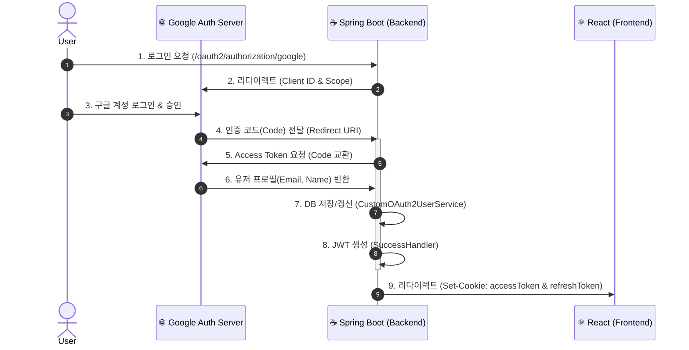

# 🔐 인증 시스템 구축 가이드 (OAuth2 + JWT)

이 문서는 구글 소셜 로그인부터 JWT 발급, 그리고 보안 쿠키 설정까지의 **전체 인증 파이프라인**을 설명합니다.

---

## 1. 전체 인증 흐름 (Authentication Flow)

사용자가 "구글 로그인"을 클릭했을 때 내부적으로 일어나는 과정입니다.



---

## 2. Google Cloud Console 설정 (Prerequisites)

구글 로그인을 위해 GCP 프로젝트에서 발급받아야 할 정보입니다.

### 🔹 필수 설정값
UI는 변경될 수 있으므로, 아래 **설정값(Value)** 이 정확한지 확인하는 것이 중요합니다.

| 항목 | 설정값 / 설명 |
| :--- | :--- |
| **Authorized JavaScript Origins** | `http://localhost:8080`, `https://ps-signal.com` |
| **Authorized Redirect URIs** | `http://localhost:8080/login/oauth2/code/google`<br>`https://ps-signal.com/login/oauth2/code/google` |
| **Scopes (범위)** | `email`, `profile` |

> **⚠️ 주의사항:**
> * `Redirect URI` 끝에 `/login/oauth2/code/google`은 스프링 시큐리티의 기본 경로이므로 토씨 하나 틀리면 안 됩니다.
> * 로컬(`localhost`)과 운영(`ps-signal.com`) 주소를 모두 등록해야 합니다.

---

## 3. 스프링 부트 설정 (Configuration)

🔹 `application-secret.yml`
- 민감 정보는 별도 파일로 분리하여 관리합니다. (.gitignore 필수)

```yaml
spring:
  security:
    oauth2:
      client:
        registration:
          google:
            client-id: "발급받은_CLIENT_ID"
            client-secret: "발급받은_CLIENT_SECRET"
            scope:
              - email
              - profile
jwt:
  secret: "32글자_이상의_매우_긴_랜덤_시크릿_키_Base64_권장"
```

🔹 `SecurityConfig.java` (핵심 필터 체인)
- 왜 sessionManagement를 STATELESS로 했는지, 필터 순서는 어떻게 되는지 기억해야 합니다.

```java
@Bean
public SecurityFilterChain filterChain(HttpSecurity http) throws Exception {
    http
        // 1. 기본 보안 설정
        .csrf(AbstractHttpConfigurer::disable) // JWT 사용 시 CSRF 불필요
        .httpBasic(AbstractHttpConfigurer::disable)
        .formLogin(AbstractHttpConfigurer::disable)
        
        // 2. 세션 정책: 상태를 저장하지 않음 (Stateless)
        .sessionManagement(session -> 
            session.sessionCreationPolicy(SessionCreationPolicy.STATELESS))

        // 3. OAuth2 설정
        .oauth2Login(oauth2 -> oauth2
            .userInfoEndpoint(userInfo -> userInfo.userService(customOAuth2UserService)) // 데이터 처리
            .successHandler(oAuth2AuthenticationSuccessHandler) // 성공 후 JWT 발급
            .failureHandler(oAuth2AuthenticationFailureHandler)) // 실패 처리
        
        // 4. JWT 필터 등록 (UsernamePasswordAuthenticationFilter 앞단)
        .addFilterBefore(tokenAuthenticationFilter, UsernamePasswordAuthenticationFilter.class);

    return http.build();
}
```

---

## 4. 핵심 구현 로직 (Core Logic)

📌 A. 유저 정보 처리 (`CustomOAuth2UserService`)
- 구글에서 받은 정보를 우리 DB 스키마(`Member`)에 맞게 변환하고 저장(`saveOrUpdate`)합니다.

```java
@Override
@Transactional
public OAuth2User loadUser(OAuth2UserRequest userRequest) throws OAuth2AuthenticationException {
    // 1. 구글에서 유저 정보 가져오기 (대리자 사용)
    OAuth2UserService<OAuth2UserRequest, OAuth2User> delegate = new DefaultOAuth2UserService();
    OAuth2User oAuth2User = delegate.loadUser(userRequest);

    // 2. 어떤 서비스인지(google), 어떤 필드가 ID인지(sub) 확인
    String registrationId = userRequest.getClientRegistration().getRegistrationId();
    String userNameAttributeName = userRequest.getClientRegistration().getProviderDetails()
            .getUserInfoEndpoint().getUserNameAttributeName();

    // 3. DTO로 변환
    OAuthAttributes attributes = OAuthAttributes.of(registrationId, userNameAttributeName, oAuth2User.getAttributes());

    // 4. DB 저장 또는 업데이트
    Member member = saveOrUpdate(attributes);

    // 5. 시큐리티 세션에 저장할 객체 반환
    // (세션을 안 쓰더라도, 임시적으로 Authentication 객체를 만들기 위해 필요)
    return new DefaultOAuth2User(
            Collections.singleton(new SimpleGrantedAuthority(member.getRoleKey())),
            attributes.getAttributes(),
            attributes.getNameAttributeKey());
}

private Member saveOrUpdate(OAuthAttributes attributes) {
    Member member = memberRepository.findByEmail(attributes.getEmail())
            .map(entity -> entity.updateNickname(attributes.getName())) // 닉네임 변경 시 반영
            .orElse(attributes.toEntity()); // 없으면 Entity 생성

    return memberRepository.save(member);
}
```

📌 B. JWT 발급 핸들러 (`OAuth2AuthenticationSuccessHandler`)
- 로그인 성공 직후 실행되며, 여기서 Access Token과 Refresh Token을 생성합니다.
- 보안과 생산성을 위해 모든 토큰을 HttpOnly 쿠키에 담아 전송합니다.

```java
@Override
public void onAuthenticationSuccess(HttpServletRequest request, HttpServletResponse response, Authentication authentication) throws IOException {
    // 1. 토큰 생성
    JwtToken jwtToken = jwtTokenProvider.generateToken(authentication);

    // 2. Access Token -> HttpOnly Cookie (SameSite=Lax 필수)
    ResponseCookie accessTokenCookie = ResponseCookie.from("access_token", jwtToken.getAccessToken())
            .path("/")
            .httpOnly(true)
            .secure(true) // HTTPS Only
            .sameSite("Lax") // CSRF 1차 방어선
            .maxAge(1800)
            .build();

    // 3. Refresh Token -> HttpOnly Cookie
    ResponseCookie refreshTokenCookie = ResponseCookie.from("refresh_token", jwtToken.getRefreshToken())
            .path("/")
            .httpOnly(true)
            .secure(true)
            .sameSite("Lax")
            .maxAge(60 * 60 * 24 * 14)
            .build();

    // 4. 응답 헤더에 추가 및 리다이렉트
    response.addHeader(HttpHeaders.SET_COOKIE, accessTokenCookie.toString());
    response.addHeader(HttpHeaders.SET_COOKIE, refreshTokenCookie.toString());
    getRedirectStrategy().sendRedirect(request, response, redirectUri);
}
```

---

## 5. 보안 아키텍처 의사결정 (ADR)

### Q. 왜 Authorization Header 대신 'Full Cookie' 방식을 택했는가?

일반적으로 보안성이 더 높다고 알려진 'Header(Access) + Cookie(Refresh)' 하이브리드 방식 대신, 현재는 **모든 토큰을 쿠키에 담는 전략**을 선택했습니다.

#### 1. 현재 구현: Full Cookie Strategy
* **구현 방식:** Access Token과 Refresh Token 모두 `HttpOnly Cookie`에 저장.
* **선택 이유 (Justification):**
    * **XSS 방어 (최우선):** 자바스크립트(`document.cookie`)로 토큰에 접근할 수 없어, 게시판 등의 스크립트 삽입 공격으로부터 안전함.
    * **생산성:** 프론트엔드(React)에서 매 API 요청마다 헤더를 수동으로 붙이는 인터셉터 로직을 짤 필요 없이, 브라우저가 자동으로 쿠키를 보내주므로 개발 속도가 빠름.
* **보완책 (Mitigation):**
    * 쿠키 방식의 취약점인 CSRF(사이트 간 요청 위조)를 막기 위해 **`SameSite=Lax`** 속성을 강제 적용하여, 외부 사이트에서의 공격 요청을 브라우저 레벨에서 차단함.

### 🔄 Silent Refresh (조용한 갱신) 흐름
사용자가 로그아웃되지 않도록, Access Token 만료 시 백그라운드에서 자동으로 쿠키를 갱신합니다.

1.  **Frontend:** API 요청 → `401 Unauthorized` 에러 수신.
2.  **Frontend:** `POST /api/v1/auth/refresh` 요청 (이때, `Refresh Token` 쿠키가 자동으로 실려감).
3.  **Backend:** 쿠키 검증 후 새로운 `Access Token`을 **쿠키(Set-Cookie)로 재발급**.
4.  **Frontend:** 별도의 저장 로직 없이, 실패했던 API 요청을 즉시 **재시도(Retry)**. (브라우저가 갱신된 쿠키를 자동으로 전송)