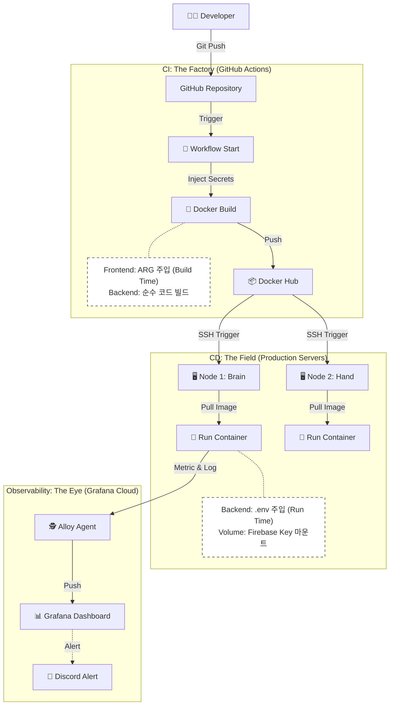

# 🚀 배포 및 인프라 가이드 (Deployment & Infrastructure)

이 문서는 로컬 개발 환경 실행부터 오라클 클라우드(Oracle Cloud) 운영 서버 배포, 그리고 CI/CD 파이프라인의 구조를 설명합니다.

---

## 1. 환경 변수 설정 (Environment Variables)

보안을 위해 `.env` 파일은 깃허브에 업로드되지 않습니다. 아래 템플릿을 참고하여 각 환경에 맞는 설정 파일을 생성해야 합니다.

### 🔹 `.env` (Backend & Runtime)
서버 실행 시점(Runtime)에 주입되는 OS 환경변수입니다. `apps/catalog-service` 및 운영 서버 루트에 위치해야 합니다.

```bash
# [Database]
MYSQL_ROOT_PASSWORD=your_root_password
MYSQL_DATABASE=pstracker
MYSQL_USER=pstracker_user
MYSQL_PASSWORD=your_db_password

# [Application]
APP_PROFILE=prod
LOG_LEVEL=INFO

# [Security & Auth]
JWT_SECRET=your_very_long_base64_secret_key_minimum_32_chars
OAUTH_CLIENT_ID=your_google_client_id
OAUTH_CLIENT_SECRET=your_google_client_secret

# [External API]
DISCORD_WEBHOOK_URL=[https://discord.com/api/webhooks/](https://discord.com/api/webhooks/)...
GOOGLE_AI_KEY=your_gemini_api_key

...
```

- ⚠️ 중요 (Build-Time Injection): React 앱은 Docker Image 빌드 시점에 위 변수들이 자바스크립트 코드로 치환(Hard-coding)됩니다. 따라서 운영 환경 배포 시에는 .env 파일이 아닌 GitHub Actions Secrets와 Docker Build Args를 통해 값을 주입해야 합니다.

---

## 2. 로컬 개발 환경 실행 (Local Development)
개발 편의성을 위해 API(Brain)와 크롤러(Hand)를 하나의 Docker Compose로 통합하여 실행합니다.

### 📋 사전 준비 (Prerequisites)
- Docker Desktop & Docker Compose 설치
- Java 21+ (IntelliJ 로컬 디버깅용)
- Node.js 20+ (프론트엔드 로컬 실행용)

### 🚀 실행 명령어 (Run Command)
프로젝트 루트(msa/)에서 실행합니다.

```bash
# 1. 통합 개발 환경 실행 (DB, API, Frontend, Crawler, Adminer)
docker compose -f docker-compose-local.yml up -d --build

# 2. 로그 확인 (실시간)
docker compose logs -f docker-compose-local.yml
```

### 📡 접속 정보

| 서비스 | URL                                   | 설명 |
| :--- |:--------------------------------------| :--- |
| **Frontend** | `http://localhost`                    | React 웹 애플리케이션 (Nginx) |
| **Backend API** | `http://localhost:8080`               | Spring Boot API 서버 |
| **Crawler Logs** | `docker logs -f ps-tracker-collector` | Playwright는 Headless로 동작하므로 docker logs로 확인 |
| **DB Admin** | `http://localhost:8090`               | Adminer (MySQL GUI 도구) |

---

## 3. 운영 서버 배포 (Production Deployment)
운영 환경(Oracle Cloud)에서는 리소스 격리를 위해 **Brain(Node 1)** 과 **Hand(Node 2)** 로 서버를 물리적으로 분리하여 배포합니다.

### 🏗️ 인프라 아키텍처 (Dual-Node)
- Node 1 (Brain): 10.0.0.161 (Private IP) / API, DB, Frontend, Alloy
- Node 2 (Hand): 10.0.0.61 (Private IP) / Python Crawler, Playwright (Headless)

#### ① Node 1: Brain Server 배포
```bash
# 1. 최신 이미지 Pull & 실행
docker compose -f docker-compose-brain.yml pull
docker compose -f docker-compose-brain.yml up -d

# 2. 불필요한 이미지 정리
docker image prune -f
```

#### ② Node 2: Hand Server 배포
```bash
# 1. 최신 이미지 Pull & 실행
docker compose -f docker-compose.hand.yml pull
docker compose -f docker-compose.hand.yml up -d
```

#### 🧪 네트워크 연결 테스트
Node 1(Brain)에서 Node 2(Hand)로 사설 통신이 가능한지 확인합니다.
```bash
# Node 1 터미널에서 실행
curl -X POST [http://10.0.0.61:5000/run](http://10.0.0.61:5000/run)
# 예상 응답: {"status": "started"}
```

---

## 4. CI/CD 파이프라인 (GitHub Actions)

**Zero-Touch Deployment**를 위해 코드가 푸시되면 빌드부터 배포까지 자동으로 수행됩니다.

### 🏭 전략: Build Time vs Run Time (The Separation)
로컬 개발 환경과 달리, CI/CD 환경에서는 **"변수 주입 시점"** 이 핵심입니다. 우리는 보안과 프레임워크 특성에 따라 주입 시점을 엄격히 분리했습니다.

| 구분 | Build Time (공장/조립) | Run Time (현장/실행) |
| :--- | :--- | :--- |
| **개념** | 도커 이미지를 굽는(Build) 시점 | 컨테이너를 실행(Up)하는 시점 |
| **주체** | **GitHub Actions** (Runner) | **Operating Server** (Brain/Hand) |
| **대상** | **Frontend (React)** | **Backend (Java/Python)** |
| **이유** | React는 빌드 시점에 환경변수가 JS 코드로 치환(Hardcoded)되어 정적 파일로 변환됨. | 서버 애플리케이션은 실행 시점에 OS 환경변수나 파일을 읽어서 동적으로 설정함. |
| **방법** | `ARG` & `build-args`로 GitHub Secrets 주입 | `env_file` (.env) 및 `Volume Mount`로 서버 파일 주입 |

### 🔄 파이프라인 흐름도 (Workflow Diagram)
개발자가 코드를 푸시하면 **'공장(CI)'**에서 이미지를 만들고, **'현장(CD)'**으로 배송하여 실행하며, **'관제탑(Alloy)'**이 이를 감시하는 구조입니다.



### 🔄 워크플로우 파일 구조 (`.github/workflows/`)

| 파일명 | 역할 | 트리거 조건 |
| :--- | :--- | :--- |
| `deploy-brain.yml` | Backend(Java) & Frontend(React) 빌드 및 Node 1 배포 | `apps/catalog-service/**`, `apps/frontend/**` 변경 시 |
| `deploy-face.yml` | Frontend(React) 빌드 및 Node 1 배포 | `apps/frontend/**` 변경 시 |
| `deploy-hand.yml` | Crawler(Python) 빌드 및 Node 2 배포 | `apps/collector-service/**` 변경 시 |
| `deploy-observability.yml` | Alloy(Monitoring) 설정 배포 및 재시작 | `config.alloy` 변경 시 |

### 🛠️ 빌드 타임 변수 주입 전략 (Frontend)
React는 런타임에 환경변수를 읽을 수 없으므로, Docker 빌드 시점에 값을 주입하는 것이 핵심입니다.

#### 1. Dockerfile (`apps/frontend/Dockerfile`)

```Dockerfile
# ARG로 변수 선언
ARG VITE_API_BASE_URL
ARG VITE_FIREBASE_API_KEY
#...

# ENV로 변환하여 빌드 과정에서 사용 가능하게 함
ENV VITE_API_BASE_URL=$VITE_API_BASE_URL
ENV VITE_FIREBASE_API_KEY=$VITE_FIREBASE_API_KEY
#...
RUN npm run build
```

#### 2. GitHub Actions (`deploy-face.yml`)

```yaml
- name: Build and push Docker image
  uses: docker/build-push-action@v5
  with:
    build-args: |
      VITE_API_BASE_URL=${{ secrets.VITE_API_BASE_URL }}
      VITE_FIREBASE_API_KEY=${{ secrets.VITE_FIREBASE_API_KEY }}
      VITE_GA_MEASUREMENT_ID=${{ secrets.VITE_GA_MEASUREMENT_ID }}
      # ... (기타 Firebase 설정)
```
#### 🗝️ 환경 변수 관리 전략 (Secrets Management)
- GitHub Secrets: CI 단계에서 필요한 빌드 재료(React Key)와 배포 자격 증명(SSH Key, Docker ID)을 암호화하여 저장.
- Server .env: CD 단계(런타임)에서 필요한 DB 비밀번호, Discord URL 등은 운영 서버 내부의 `.env` 파일로 격리하여 관리.
- Hybrid Loading: FirebaseConfig 등 핵심 설정 클래스는 "환경변수가 있으면 그것을(Prod), 없으면 내부 파일을(Local)" 읽도록 설계하여 코드 수정 없이 환경 대응.

### 🛡️ 신뢰성 중심 배포 (Reliability-First Deployment)
기존에는 빌드 속도를 위해 테스트를 생략(`-x test`)했으나, 안정성 확보를 위해 **배포 전 테스트 수행을 의무화**했습니다.
- Docker 빌드 시 `./gradlew test`가 자동으로 수행됩니다.
- 테스트 실패 시(Red) 빌드가 즉시 중단되어, 결함 있는 코드가 운영 서버에 배포되는 것을 원천 차단합니다.

---

## 5. SSL 인증서 설정 (Nginx & Certbot)
HTTPS 적용을 위해 Let's Encrypt 인증서를 사용하며, 자동 갱신 설정이 적용되어 있습니다.

### 📜 인증서 발급 명령어 (초기 1회)
```bash
# Nginx를 잠시 끄지 않고 Webroot 방식으로 발급
docker compose run --rm certbot certonly --webroot --webroot-path /var/www/certbot -d ps-signal.com
```

### 🔄 인증서 자동 갱신 설정
운영 서버의 crontab을 통해 주기적으로 갱신하고 Nginx 설정을 리로드합니다.
```bash
# 매월 1일, 15일 새벽 3시에 갱신 시도
0 3 1,15 * * cd /home/ubuntu/backend-lab/msa && docker compose run --rm certbot renew && docker compose kill -s SIGHUP ps-tracker-web
```