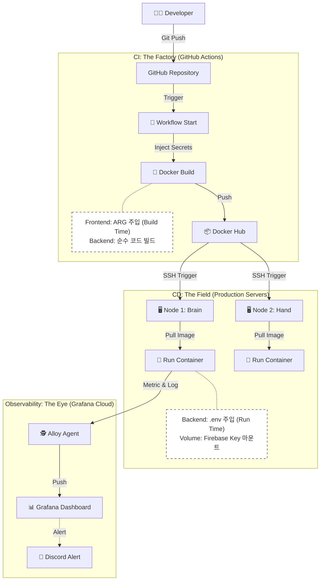

# 🚀 배포 및 인프라 가이드 (Deployment & Infrastructure)

이 문서는 CI/CD 파이프라인 구조, SSL 인증서 전략, 멀티 아키텍처 빌드의 의사결정을 설명합니다.

> 로컬 실행 명령어, 운영 서버별 배포 절차, 환경 변수 설정은 → [RUNBOOK.md](RUNBOOK.md)

---

## 1. CI/CD 파이프라인 (GitHub Actions)

**Zero-Touch Deployment**를 위해 코드가 푸시되면 빌드부터 배포까지 자동으로 수행됩니다.

### 🏭 전략: Build Time vs Run Time (The Separation)
로컬 개발 환경과 달리, CI/CD 환경에서는 **"변수 주입 시점"** 이 핵심입니다. 보안과 프레임워크 특성에 따라 주입 시점을 엄격히 분리했습니다.

| 구분 | Build Time (공장/조립) | Run Time (현장/실행) |
| :--- | :--- | :--- |
| **개념** | 도커 이미지를 굽는(Build) 시점 | 컨테이너를 실행(Up)하는 시점 |
| **주체** | **GitHub Actions** (Runner) | **Operating Server** (Brain/Hand) |
| **대상** | **Frontend (React)** | **Backend (Java/Python)** |
| **이유** | React는 빌드 시점에 환경변수가 JS 코드로 치환(Hardcoded)되어 정적 파일로 변환됨. | 서버 애플리케이션은 실행 시점에 OS 환경변수나 파일을 읽어서 동적으로 설정함. |
| **방법** | `ARG` & `build-args`로 GitHub Secrets 주입 | `env_file` (.env) 및 `Volume Mount`로 서버 파일 주입 |

### 🔄 파이프라인 흐름도 (Workflow Diagram)
개발자가 코드를 푸시하면 **'공장(CI)'**에서 이미지를 만들고, **'현장(CD)'**으로 배송하여 실행하며, **'관제탑(Alloy)'**이 이를 감시하는 구조입니다.



### 🔄 워크플로우 파일 구조 (`.github/workflows/`)

| 파일명 | 역할 | 트리거 조건 |
| :--- | :--- | :--- |
| `deploy-brain.yml` | Backend(Java) 빌드·테스트 및 Node 1 배포 | `apps/catalog-service/**` 변경 시 |
| `deploy-face.yml` | Frontend(React) 빌드 및 Node 1 배포 | `apps/frontend/**` 변경 시 |
| `deploy-hand.yml` | Crawler(Python) 빌드 및 Node 2 (Shard A) 배포 | `apps/collector-service/**` 변경 시 |
| `deploy-hand-3.yml` | Crawler(Python) 빌드 및 Node 3 (Shard B) 배포 | `apps/collector-service/**` 변경 시 |
| `deploy-observability.yml` | Alloy(Monitoring) 설정 배포 및 재시작 | `config.alloy` 변경 시 |

### 🛠️ 빌드 타임 변수 주입 전략 (Frontend)
React는 런타임에 환경변수를 읽을 수 없으므로, Docker 빌드 시점에 값을 주입하는 것이 핵심입니다.

```Dockerfile
# ARG로 변수 선언 후 ENV로 변환하여 npm build에 노출
ARG VITE_API_BASE_URL
ARG VITE_FIREBASE_API_KEY
ENV VITE_API_BASE_URL=$VITE_API_BASE_URL
ENV VITE_FIREBASE_API_KEY=$VITE_FIREBASE_API_KEY
RUN npm run build
```

```yaml
# GitHub Actions에서 Secrets를 build-args로 주입
- name: Build and push Docker image
  uses: docker/build-push-action@v5
  with:
    build-args: |
      VITE_API_BASE_URL=${{ secrets.VITE_API_BASE_URL }}
      VITE_FIREBASE_API_KEY=${{ secrets.VITE_FIREBASE_API_KEY }}
      VITE_GA_MEASUREMENT_ID=${{ secrets.VITE_GA_MEASUREMENT_ID }}
```

**환경 변수 관리 전략:**
- GitHub Secrets: CI 단계의 빌드 재료(React Key)와 배포 자격 증명(SSH Key, Docker ID) 암호화 저장.
- Server .env: CD 단계(런타임)의 DB 비밀번호, Discord URL 등은 운영 서버 내부 `.env` 파일로 격리.
- Hybrid Loading: FirebaseConfig 등 핵심 설정 클래스는 "환경변수가 있으면 그것을(Prod), 없으면 내부 파일을(Local)" 읽도록 설계하여 코드 수정 없이 환경 대응.

### 🛡️ 신뢰성 중심 배포 (Reliability-First Deployment)
기존에는 빌드 속도를 위해 테스트를 생략(`-x test`)했으나, 안정성 확보를 위해 **배포 전 테스트 수행을 의무화**했습니다.
- CI 파이프라인의 독립 스텝(`Run Tests`)에서 `./gradlew test`가 수행됩니다.
- Dockerfile 내 빌드는 `-x test`로 테스트를 제외하여 빌드 시간을 단축하고, 테스트와 빌드의 역할을 명확히 분리했습니다.
- 테스트 실패 시(Red) 이후 단계가 즉시 중단되어, 결함 있는 코드가 운영 서버에 배포되는 것을 원천 차단합니다.

---

## 2. SSL 인증서 설정 (Caddy — 현재)

Nginx + Certbot 방식에서 **Caddy**로 전환하여 SSL 인증서 관리를 완전 자동화했습니다.

### 🔒 Caddy 설정 (Caddyfile)

```
ps-signal.com, www.ps-signal.com {
    reverse_proxy frontend:80
}
```

이 3줄만으로 Let's Encrypt 인증서 발급, 갱신, HTTPS 리다이렉트를 Caddy가 내부에서 모두 처리합니다. 별도의 crontab, certbot 컨테이너, 볼륨 마운트가 필요 없습니다.

> **이전 방식 (Nginx + Certbot, 현재 미사용)**
>
> 초기에는 Certbot + crontab으로 Let's Encrypt 인증서를 발급/갱신했습니다.
> 서버 이전 시마다 certbot 컨테이너·crontab·볼륨 마운트를 모두 재구성해야 하는 운영 부담이 있었으며,
> Oracle A1 신규 서버 이전을 계기로 Caddy로 전환하여 이 부담을 완전히 제거했습니다.

---

## 3. 멀티 아키텍처 빌드 전략 (Multi-Architecture Build)

### 🏗️ 배경: ARM64 서버 이전과 에뮬레이션 문제

Oracle A1 ARM64 서버로 이전 후, 초기에는 기존 AMD64 이미지에 `platform: linux/arm64`를 추가하여 실행했습니다. 그러나 성능 체감이 없었는데, 원인은 **QEMU가 런타임에 모든 CPU 명령어를 실시간 번역**하여 실제 서버 성능의 30~50%만 발휘되었기 때문입니다.

### 🔧 해결: 플랫폼별 네이티브 이미지 빌드

GitHub Actions의 **QEMU + Buildx** 조합으로 `linux/amd64,linux/arm64` 멀티 플랫폼 이미지를 빌드하여 Docker Hub에 푸시합니다. A1 서버는 자신의 아키텍처에 맞는 ARM64 네이티브 이미지를 자동으로 선택하여 실행하므로 에뮬레이션 오버헤드가 없습니다.

```yaml
- name: Build and Push Docker Image
  uses: docker/build-push-action@v5
  with:
    platforms: linux/amd64,linux/arm64  # 두 아키텍처 동시 빌드
    push: true
```

이 방식은 **인프라 이식성(Portability)**도 보장합니다. Docker Hub에 올라간 이미지가 어떤 아키텍처 서버에서도 최적 성능으로 실행 가능하므로, 이후 서버 이전 시 코드 수정 없이 즉시 배포 가능합니다.

### ⚡ 프론트엔드 Builder 스테이지 최적화

`npm ci`는 QEMU 에뮬레이션 환경에서 **4시간 이상 소요 후 크래시**(`Illegal instruction`)가 발생했습니다. `FROM --platform=$BUILDPLATFORM`으로 Builder 스테이지를 CI 러너(AMD64)의 네이티브 환경에서 실행하여 해결했습니다.

```dockerfile
# Builder는 CI 러너(AMD64)에서 네이티브로 실행 → npm 크래시 없음
FROM --platform=$BUILDPLATFORM node:22-alpine AS builder
RUN npm ci && npm run build

# Final 스테이지는 타겟 플랫폼(ARM64)으로 빌드됨
FROM nginx:alpine
COPY --from=builder /app/dist /usr/share/nginx/html
```

이 방식은 **자급자족 Dockerfile**을 유지하면서(로컬 `docker build .` 정상 동작), CI 빌드 시간도 대폭 단축합니다.
