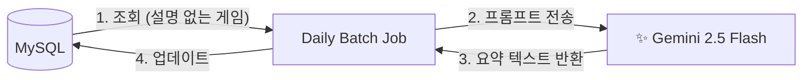

# 🔌 외부 서비스 연동 가이드 (External Services & AI)

이 문서는 PS-Tracker가 활용하는 서드파티 서비스(Google Gemini, Firebase, Discord)의 **도입 배경**과 **현실적인 제약 극복 과정**을 설명합니다.

---

## 1. Google Gemini (AI Game Summarizer)

게임의 상세 정보(줄거리, 특징)를 사용자가 읽기 쉽게 **3줄 요약** 해주는 기능을 위해 도입했습니다.

### 🏗️ 아키텍처 및 데이터 흐름
사용자 요청 시점에 AI를 호출하는 것이 아니라, **별도의 스케줄러(Daily Batch)** 가 데이터를 채워 넣는 구조입니다.

### 🧠 기술적 의사결정 (Technical Decisions)

#### ① 모델 선정 및 비용 최적화 (Model Selection)
* **Model:** `gemini-2.5-flash`
* **Why:** 텍스트 요약과 같은 단순 작업에는 Pro 모델보다 Flash 모델이 속도가 빠르고 비용 효율적임.

#### ② 배치 처리 전환 (Real-time vs Batch)
* **Initial Plan:** 크롤링 시점이나 사용자 조회 시점에 실시간으로 AI 요약을 생성하려 했음.
* **Problem (Quota Limit):** 확인 결과, Gemini 무료 티어의 API 호출 제한이 존재하여 실시간 서비스 적용 시 금방 할당량이 고갈될 위험이 있음.
* **Assessment:** 게임 설명 데이터는 구매 결정에 도움을 주지만, 가격 정보처럼 **즉시성이 중요한 데이터(Critical Data)**는 아니라고 판단함.
* **Decision:** **"하루 20개"**로 제한된 **일일 배치(Daily Batch)**로 전환. 설명이 없는 인기 게임부터 순차적으로 채워나가는 방식을 채택하여 API 비용 0원 유지.

#### ③ 공식 라이브러리 제거 (Dependency Diet)
* **Problem:** `spring-ai` 등 편의성 라이브러리가 무겁고, Google AI Studio의 Native 엔드포인트와 호환성 문제(404) 발생.
* **Solution:** 무거운 라이브러리를 걷어내고, Spring Boot 내장 **`RestClient`**를 사용하여 HTTP 요청을 직접 구현.

---

## 2. Firebase Cloud Messaging (FCM)

사용자가 찜한 게임의 가격이 하락했을 때, 브라우저로 **웹 푸시(Web Push)**를 보내기 위해 사용합니다.

### 🔔 비동기 처리 전략 (@Async)
* **Context:** 가격 변동 이벤트(`GamePriceChangedEvent`)가 발생하면 알림을 발송해야 함.
* **Problem:** FCM 서버와의 통신(Network I/O)은 지연될 수 있으며, 이로 인해 메인 로직(가격 갱신 트랜잭션)이 길어지는 것은 위험함.
* **Solution:** 이벤트 리스너에 **`@Async`**를 적용하여, 알림 발송 로직을 별도 스레드에서 비동기로 처리. 알림 발송이 실패하더라도 가격 갱신 로직에는 영향을 주지 않도록 격리.

### 📱 토큰 관리 (1:N)
* **Strategy:** 사용자가 PC와 모바일 등 여러 기기에서 로그인할 수 있으므로, `Member`와 `FcmToken`을 1:N 관계로 설계하여 등록된 모든 기기에 동시 발송.

---

## 3. Discord Webhook (System Alert)

운영자(개발자)에게 서버의 상태와 수집 결과를 알리기 위해 도입했습니다.

### 📢 채널 분리 정책
알림의 성격에 따라 채널을 분리하여 노이즈를 관리합니다.

| 채널명 | 용도 | 주체 (Sender) | 내용 |
| :--- | :--- | :--- | :--- |
| **#server-monitor** | 🚨 장애 알림 | **Java (Brain)** | 서버 다운(Deadman Switch) |
| **#price-alert** | 💰 수집 결과 | **Python (Hand)** | 크롤링 작업이 끝난 후, 가격 변동 및 할인 정보를 **표(Table)** 형태로 정리하여 단건 발송 |

### 🛡️ 발송 시점 (Timing)
* **Server Monitor:** 이상 징후 감지 시 즉시(Real-time) 발송.
* **Price Alert:** 크롤링 프로세스가 완전히 종료된 후, 수집된 데이터를 요약하여 **1회 리포팅**. (수집 도중 건건이 보내지 않음)