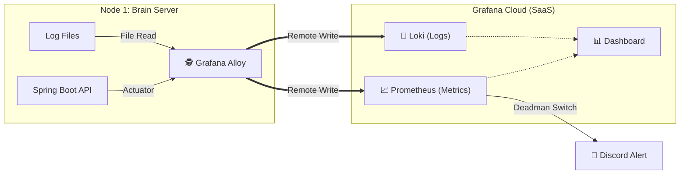

# 📡 관측성 및 모니터링 가이드 (Observability with PLG)

이 문서는 제한된 리소스(1GB RAM) 환경에서 서버의 상태를 실시간으로 감시하기 위해 구축한 **PLG 스택(Prometheus, Loki, Grafana)**의 아키텍처와 설정 방법을 설명합니다.

---

## 1. 모니터링 아키텍처 (Architecture)

우리는 자체 모니터링 서버를 구축하는 대신, **Grafana Cloud (SaaS)**를 활용하여 운영 부담을 덜고 리소스를 절약하는 전략을 선택했습니다.

### 🏗️ 데이터 흐름 (Data Flow)
서버에 설치된 초경량 수집기(**Alloy**)가 데이터를 긁어서(Pull/Read), 클라우드 저장소로 전송(Push)합니다.



---

## 2. 리소스 다이어트 전략 (Resource Optimization)

Oracle Cloud Free Tier(1GB RAM) 환경에서 모니터링 에이전트가 메인 서비스(Java)를 죽이는 주객전도 현상을 막기 위해 철저한 리소스 제한을 적용했습니다.

### 📉 용량 산정 과정 (Capacity Planning)
단순한 감(Guess)이 아닌, **실제 운영 중인 컨테이너의 리소스 점유율(Footprint)** 을 측정하여 최적의 한계점을 산출했습니다.

1. **측정 명령어 (Monitoring Command):**
   ```bash
   # 실시간 컨테이너 리소스 점유율 확인
   docker stats --no-stream
   ```
   
2. 튜닝 기록 (Tuning Log):
- 1차 시도 (0.1 CPU / 64MB): 초기 구동은 성공했으나, 로그 수집량이 급증하는 시점에 메모리 부족으로 컨테이너가 강제 재시작(Restart)되는 현상 발견.
- 최종 결정 (0.2 CPU / 128MB): 평시 점유율(약 40~50MB) 대비 **2배 이상의 안전 마진(Safety Margin)** 을 확보하여, 스파이크가 튀어도 OOM이 발생하지 않도록 설정.
   
### 📉 Grafana Alloy 컨테이너 제한 (`docker-compose-brain.yml`)

```yaml
deploy:
  resources:
    limits:
      cpus: '0.2'        # CPU 20% 초과 사용 금지
      memory: "128M"     # 메모리 128MB 초과 시 OOM Kill
```

- Lightweight: 무거운 Java 기반 에이전트 대신 Go 언어 기반의 Alloy 사용.
- Log Throttling: 로그 수집 주기를 30초(sync_period)로 설정하여 디스크 I/O 부하 최소화.

---

## 3. 수집 설정 분석 (`config.alloy`)

Alloy가 어떻게 데이터를 수집하고 전송하는지에 대한 핵심 설정입니다.

### ① 메트릭 수집 (Prometheus Scrape)
Spring Boot Actuator가 노출하는 엔드포인트를 긁어옵니다.

```groovy
prometheus.scrape "spring_app" {
    targets = [
        // 도커 네트워크 내부 DNS 사용 (http://catalog-service:8080)
        {__address__ = "catalog-service:8080"},
    ]
    metrics_path = "/actuator/prometheus"
    // 수집한 데이터를 클라우드로 전송
    forward_to   = [prometheus.remote_write.grafana_cloud_metrics.receiver]
}
```

### ② 로그 수집 (Loki File Read)
서버에 쌓이는 로그 파일을 직접 읽어서 전송합니다.

```groovy
local.file_match "app_logs" {
    // 호스트에서 마운트된 로그 폴더 경로
    path_targets = [{"__path__" = "/var/log/pstracker/*.log"}]
    sync_period = "30s" // 실시간성보다는 성능을 위해 30초 주기 동기화
}

loki.source.file "log_scrape" {
    targets    = local.file_match.app_logs.targets
    forward_to = [loki.write.grafana_cloud_logs.receiver]
}
```

### ③ 클라우드 전송 (Remote Write)
수집된 데이터를 암호화하여 Grafana Cloud로 쏘아 보냅니다. (자격 증명은 환경변수 처리)

```groovy
prometheus.remote_write "grafana_cloud_metrics" {
    endpoint {
        url = sys.env("GRAFANA_METRICS_URL")
        basic_auth {
            username = sys.env("GRAFANA_METRICS_USER")
            password = sys.env("GRAFANA_TOKEN")
        }
    }
}
```

---

## 4. 알림 시스템 (Alerting)

서버가 다운되었을 때 가장 빠르게 인지할 수 있도록 Deadman Switch 패턴을 적용했습니다.

### 🚨 Deadman Switch (생존 신고)
- 개념: "서버가 살아있다"는 신호(Metric)가 끊기면 즉시 알람을 울리는 방식.
- 조건: `up{job="spring_app"} == 0` 또는 데이터 수신 없음(No Data) 상태가 3분 이상 지속될 때.
- 채널: Discord `#server-monitor` 채널로 긴급 호출.

### 📊 주요 모니터링 지표 (Dashboard)
Grafana 대시보드에서 중점적으로 보는 지표들입니다.

1. JVM Heap Usage: 힙 메모리가 256MB 한계선에 근접하는지 감시.
2. HikariCP Connections: DB 커넥션 풀이 고갈되지 않는지 체크.
3. Log Error Rate: ERROR 레벨 로그 발생 빈도 추적.

---

## 5. 배포 및 갱신 (Deployment)

Alloy 설정이 변경(`config.alloy`)되었을 때, 전체 서버를 재시작하지 않고 Alloy 컨테이너만 독립적으로 배포합니다.

```yaml
# .github/workflows/deploy-observability.yml
on:
  push:
    paths:
      - 'msa/config.alloy'

steps:
  - name: Deploy Alloy
    script: |
      # 설정 파일만 교체 후 Alloy 서비스 재시작
      docker compose -f docker-compose-brain.yml up -d alloy
```

---

## 6. 사용자 관측성 (Client-Side Observability with GA4)

서버의 건강 상태(Grafana)뿐만 아니라, **실제 사용자가 서비스를 어떻게 이용하는지(User Behavior)**를 추적하기 위해 Google Analytics 4 (GA4)를 도입했습니다.

### 🎯 도입 배경 (Why & What)
* **Why GA4?:** 무료이면서도 강력한 데이터 분석 기능을 제공하며, React 생태계와 연동이 용이함.
* **Goal:** "어떤 게임이 가장 조회수가 높은가?", "사용자가 알림을 클릭해서 들어오는가?" 등의 **데이터 기반 의사결정** 환경 구축.

### 🚧 기술적 난관: SPA의 페이지뷰 집계 문제
* **Problem:** React와 같은 SPA(Single Page Application)는 페이지 이동 시 브라우저가 새로고침되지 않고 DOM만 갈아끼우는 방식입니다. 이로 인해 GA4는 **최초 접속 외에는 페이지 이동을 감지하지 못하는 문제**가 발생합니다.
* **Solution:** `history` API 변화를 감지하여 가상의 페이지뷰(Virtual Pageview)를 전송하는 **Custom Route Tracker**를 구현했습니다.

### 🛠️ 구현 로직 (Code Level)

**1. 라우트 추적기 (`RouteChangeTracker.jsx`)**
React Router의 `useLocation` 훅을 사용하여 URL이 바뀔 때마다 GA4에 이벤트를 전송합니다. `initialized` 상태 관리를 통해 중복 초기화를 방지했습니다.

```javascript
import { useEffect, useState } from "react";
import { useLocation } from "react-router-dom";
import ReactGA from "react-ga4";

const RouteChangeTracker = () => {
   const location = useLocation();
   const [initialized, setInitialized] = useState(false);

   // 1. 구글 애널리틱스 초기화
   useEffect(() => {
      const trackingId = import.meta.env.VITE_GA_MEASUREMENT_ID;

      if (trackingId) {
         ReactGA.initialize(trackingId);
         setInitialized(true);
      } else {
         console.warn("GA4 Tracking ID not found in .env");
      }
   }, []);

   // 2. 페이지 이동 감지 (경로가 바뀔 때마다 실행)
   useEffect(() => {
      if (initialized) {
         // 현재 경로(path) + 쿼리스트링(search)을 합쳐서 보고
         ReactGA.send({ hitType: "pageview", page: location.pathname + location.search });
      }
   }, [initialized, location]);

   return null;
};

export default RouteChangeTracker;
```

**2. 환경 변수 주입 (Security)** 
- GA4 측정 ID(`G-XXXXXX`)는 빌드 시점에 주입되도록 설계하여, 코드 베이스와 설정을 분리했습니다. (상세 내용은 `DEPLOYMENT.md` 참조)

```dockerfile
# Dockerfile
ARG VITE_GA_MEASUREMENT_ID
ENV VITE_GA_MEASUREMENT_ID=$VITE_GA_MEASUREMENT_ID
```

### 📊 주요 분석 데이터
1. Top Pages: 가장 많이 조회된 게임 상세 페이지 순위 (인기 게임 파악).
2. User Flow: 메인 페이지 -> 검색 -> 상세 페이지로 이어지는 유입 경로 분석.
3. Retention: 재방문 사용자의 비율 추적.